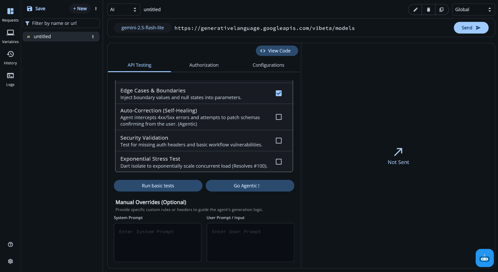
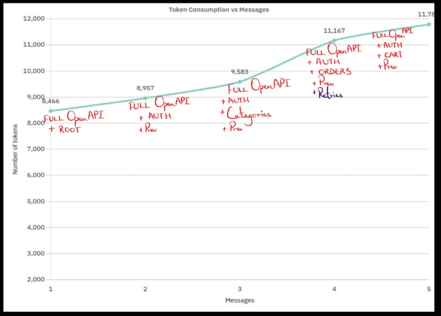
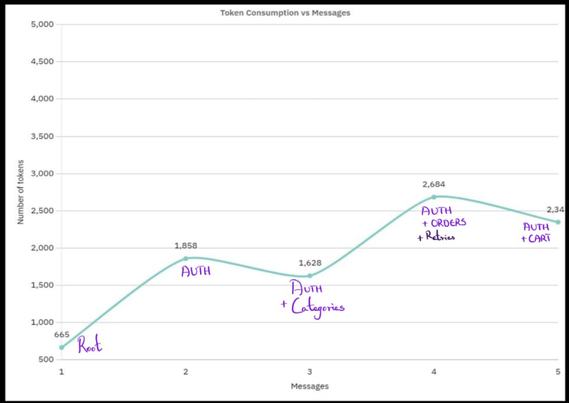
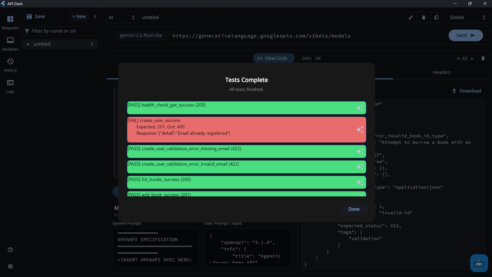
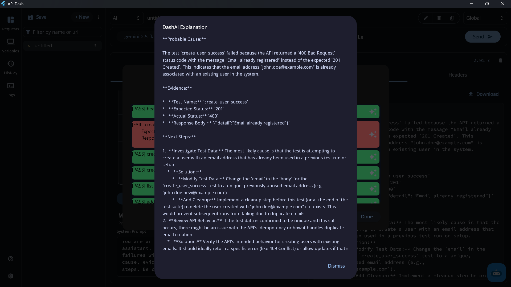
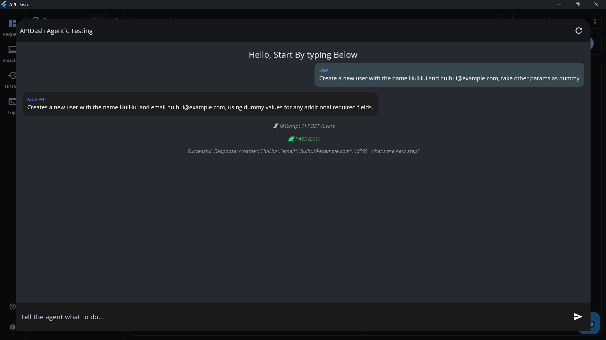
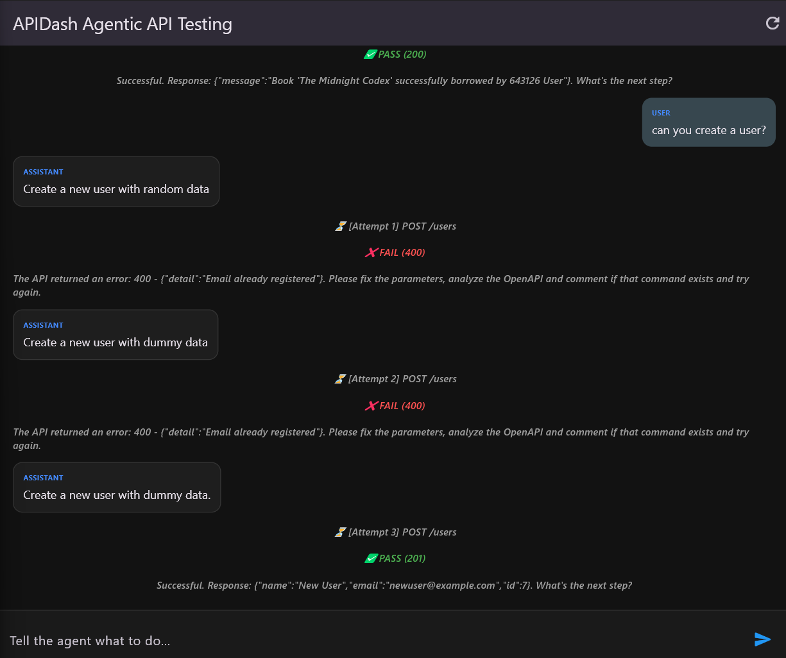
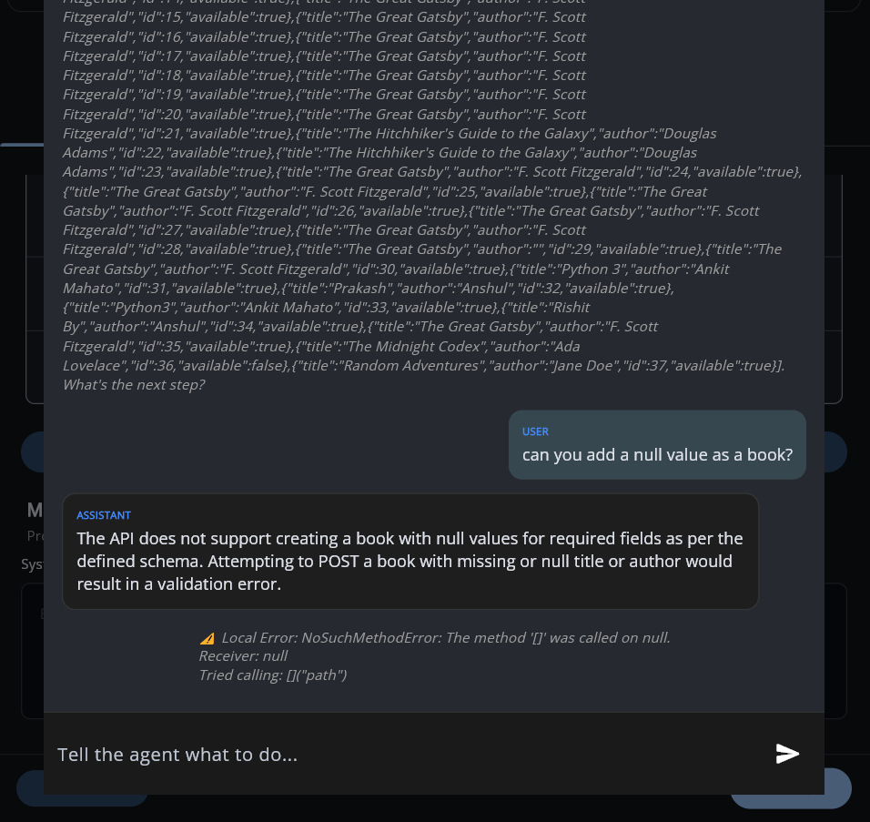
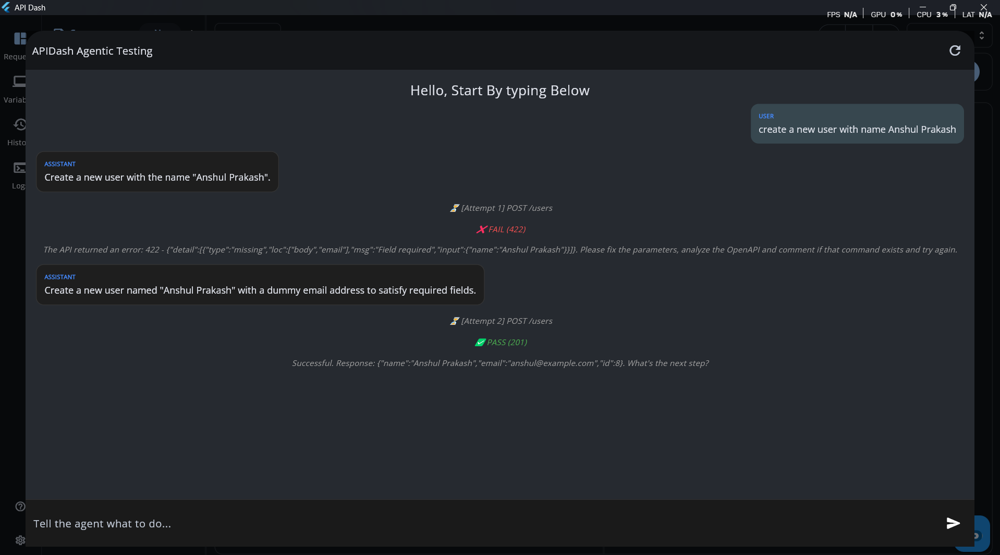
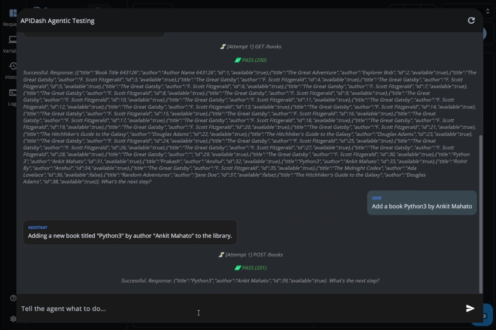

### About

1. Full Name: Anshul Prakash
2. Contact info: apsanshulprakash@gmail.com
3. Discord handle in our server: @Prakash (APIDash handle) (Discord username: nasa_kun_48906)
4. Home page: [(PrakashGPT) https://anshulprakash.tech/ ](https://anshulprakash.tech/)
5. Blog: [Devpost @apsanshulprakash](https://devpost.com/apsanshulprakash), [Dev.to @theanshulprakash](https://dev.to/theanshulprakash)
6. GitHub profile link: [@TheAnshulPrakash](https://github.com/TheAnshulPrakash)
7. Linkedin: [anshul-prakash-](https://www.linkedin.com/in/anshul-prakash-/)
8. Time zone: (IST UTC+5:30)
9. Link to resume : [Resume](https://drive.google.com/file/d/1_ycvJCeVsrysNvzsvsNrew38lXUjGjCd/view)

### University Info

1. University name: Manipal Institute of Technology, Bengaluru
2. Program you are enrolled in (Degree & Major/Minor): B.Tech. in Computer Science and Engineering
3. Year: 2nd
4. Expected graduation date: July, 2028

### Motivation & Past Experience

Short answers to the following questions (Add relevant links wherever you can):
1. Have you worked on or contributed to a FOSS project before? Can you attach repo links or relevant PRs?
    
    Yes, I've contributed to APIDash identifying 2 issues and raising corresponding PRs with video demos:
    * Issue: [Azure OpenAI model selection triggers error/crashing when endpoint URL is left empty #1075 ](https://github.com/foss42/apidash/issues/1075)
    - PR: [fix: validate endpoint URL and fix BoundedTextField memory leak #1079](https://github.com/foss42/apidash/pull/1079)

    
    * Issue: [[Bug] "invalid text selection" crash in EnvironmentTriggerField when changing request type while text is highlighted #1138](https://github.com/foss42/apidash/issues/1138)
    - PR: [fix: prevent invalid text selection crash in environment field
  #1139](https://github.com/foss42/apidash/pull/1139)

2. What is your one project/achievement that you are most proud of? Why?

    The one project I'm most proud of building is undoubtedly ***Persona***, a local AI interview coach with video analysis that I developed entirely on my own in about a month for the OpenAI x NVIDIA Hackathon.

    What makes it meaningful to me is that I built it on top of `Flet`, a Flutter-based framework that is still relatively young with limited documentation. That meant I had to figure out many design and implementation details myself while building the system.

    The application is heavily asynchronous and multithreaded, since it needs to coordinate several components simultaneously like live video analysis (OpenCV), speech-to-text (Whisper), text-to-speech (Piper-TTS), a local LLM (GPT-OSS:20b), and other processing pipelines. I designed custom pipelines to run these in parallel while keeping the UI responsive. A big challenge was making everything run smoothly on a consumer PC with only 6 GB VRAM and 24 GB RAM, which required a lot of optimization and careful resource management.

    I’m proud that I was able to design the concept, architect the system, implement every component myself, and still deliver a fully working unique, one-of-a-kind product with a smooth flow, including a compiled Windows executable within the hackathon timeframe.

    [Github Repo](https://github.com/TheAnshulPrakash/Persona)

    [Youtube demo](https://youtu.be/p3zfJGWsXyQ)

3. What kind of problems or challenges motivate you the most to solve them?

    I’m most motivated by problems where I have to build things end-to-end and actually make them work. 
    Especially when multiple technologies are involved in a single application.

    I enjoy figuring things out and bringing my ideas to life, whether that’s integrating hardware with software, running and optimizing AI models, or designing systems and workflows as a whole.

    I also care a lot about making things efficient and independent, which is why I tend to prefer local-first approaches (like Persona).

    Some of my previous solo builds also include [PrakashGPT (Flutter)](https://anshulprakash.tech/), [AltArt](https://github.com/TheAnshulPrakash/AltArt), [Suryen](https://devpost.com/software/suryen), [MarkAI](https://github.com/TheAnshulPrakash/MARK).

4. Will you be working on GSoC full-time? In case not, what will you be studying or working on while working on the project?
    
    Yes, I’ll be available full-time for GSoC 2026 since it falls during my summer break, so I won’t have any college-related commitments during that period.

    I do plan to spend some time upskilling alongside, like taking a few courses or exploring related areas, but that will be secondary and managed outside my GSoC working hours.

    My main focus during this time will be the GSoC project, and I’ll be able to dedicate consistent time and attention to it throughout the program.

5. Do you mind regularly syncing up with the project mentors?
    
   Not at all. I think regular sync-ups with mentors are important to make sure the project stays on track and aligned with the intended direction.

    I’m active on platforms like LinkedIn, Discord, and WhatsApp, and I’m comfortable with calls, screen sharing, and regular check-ins for demos or discussions whenever needed.

6. What interests you the most about API Dash?
    
    I discovered APIDash while working on my personal project [PrakashGPT (Flutter Web)](https://anshulprakash.tech/). I was looking for a way to inspect and organize API requests, compare CDN performance, and handle responses from my backend beautifully and APIDash ended up covering all of that.

    The Dart code generation was also a nice addition since it made integration easier and faster.

    Since then, I’ve been actively exploring the codebase and understanding how the workflow is structured. After spending over a month with it, I can say I have a good grasp of how things work internally.

    What excites me most is the chance to contribute to something I’ve actually used. With GSoC 2026, being able to improve APIDash and make it more useful for developers is something I’m genuinely interested in.

7. Can you mention some areas where the project can be improved?

    I think APIDash can improve by adding a more agentic API testing workflow, something that can automatically test APIs with different dummy inputs and edge cases instead of everything being manual.

    It could also handle things like validating auth flows properly and giving useful insights when something breaks or behaves unexpectedly.

    Another direction I find interesting is integrating MCP (Model Context Protocol) to make these agentic workflows more structured automated and helpful for the developer, when dealing with external AI-driven testing and execution.

    Along with that, as mentioned in Issue #100, adding containerized stress testing (possibly using Dart isolates) would be really useful to simulate load and understand how APIs perform in more realistic conditions.

    #### One more thing:
    A problem I’ve personally faced as an indie developer is that sometimes we end up using cheaper backend providers, which can lead to downtimes or performance bottlenecks without prior warning.

    Since APIDash is also available on mobile, it would be really a useful feature if it could periodically ping a root or selected endpoint from the device and notify whether the backend is alive or not. This would make it easier to catch issues and prepare our systems early without needing external monitoring setups and losing potential traffic.

8. Have you interacted with and helped API Dash community? 

    Yes.

    Links to some of my previous interaction with the community:

    - [Proposed a Video walkthrough of an unresolved issue demonstrating my approach with a video](https://github.com/foss42/apidash/issues/969#issuecomment-3902355756)

    - [Identified an overlap with an existing fix I already submitted and requested the contributor for the removal of duplicate changes to avoid redundancy in the codebase.](https://github.com/foss42/apidash/pull/1142#issuecomment-3951764303)

    - [Pointed out that the issue was a duplicate and redirected contributors to the existing issue and related revamp discussion.](https://github.com/foss42/apidash/issues/1328#issuecomment-4038565453)

    - [Provided structured review feedback by asking for clearer implementation details, proper PR formatting with issue references, a demo for verification](https://github.com/foss42/apidash/pull/1463#issuecomment-4125267425)

    - [Pointed out related Issue thread and a duplicate PR.](https://github.com/foss42/apidash/pull/1463#issuecomment-4125278555)


### Project Proposal Information

#### Proposal Title
Agentic API Testing & Stress Testing APIs for API Dash

#### Abstract: 

API Dash is great for manually interacting with APIs, but there's no way to automatically test an entire API surface without writing every request yourself.

This project builds an agentic testing engine that does that. But there's a problem I ran into while building the prototype that most approaches ignore, real `OpenAPI` specs are huge. Passing the full spec into a single LLM and handling conversations can easily cost thousands of tokens per session and starts producing hallucinated endpoints pretty quickly.

To fix this I built a `deterministic batching` algorithm that splits the spec by resource domain and only passes the relevant section to the model. Same spec, same splits every time.I measured this on a real custom spec during prototype development which brought token usage down by 81.7% on a real spec. The full breakdown is in the implementation section.

The rule the whole system follows: 
> the AI plans the tests, Dart runs them. 

The model returns a JSON test plan.

The execution engine sends the actual HTTP requests using API Dash's existing networking layer. The AI never touches the network.
Since the execution engine has no Flutter dependencies, it works in three places naturally, the API Dash UI, a CLI for CI pipelines, and as an MCP server so tools like `Claude Desktop` or `Cursor` can trigger real test runs without leaving their IDE.


## Detailed Description:
API Dash already has most of the pieces needed for something like this.

There is a networking layer (better_networking), an AI agent framework (APIDashAIAgent and genai), request collections, and environment variable handling. What’s missing is something that can connect all of those pieces into an automated testing workflow.

The idea of this project is to build that layer.

### Prototype:
Before writing this proposal I built a working prototype of the execution engine and integrated it into a fork of API Dash to validate that the architecture works and demonstrate my thinking into tackling the solution.

Prototype Working repository:

https://github.com/TheAnshulPrakash/APIDash_AgenticAPITesting

There are two short video demos included in the [README.md](https://github.com/TheAnshulPrakash/APIDash_AgenticAPITesting/blob/main/README.md) of the repository demonstrating how the engine works in my prototype.

The demos show:
- User uploading an openapi.json
- the agent generating tests analyzing that spec
- the execution engine running those tests against a local FastAPI server (A Library Management)
- the conversational Agentic mode analyzing the openapi and generating tests and correcting a 422 validation error and retrying automatically(based on its knowledge)
- Insertion of edge cases like NULL values and why they cant be implemented

The prototype currently uses a local Ollama model for agentic conversation because of API credit limits, but the design allows swapping this with API Dash’s genai infrastructure for the real implementation.

#### What I've already built
1. Deterministic OpenAPI Context Batching `(The Token Saver)` **(Key Differentiator)**

    I wrote a native Dart script that parses raw OpenAPI JSON, splits the endpoints by root domain (e.g., /auth, /products, /cart), and recursively resolves $ref schema dependencies.

    **Why it matters**: Instead of dumping a huge token file into an LLM, my algorithm initially creates schema batches. This is a deterministic Dart logic that guarantees a significant reduction in LLM context size and reduces API hallucination.

    -> [Prototype Code](https://github.com/TheAnshulPrakash/APIDash_AgenticAPITesting/blob/main/lib/screens/home_page/editor_pane/details_card/request_pane/ai_request/openapi_Context_Parsing.dart)

2. Headless API Execution Engine `(ApiTestRunner)`

    A standalone Dart execution class that seamlessly integrates API Dash's `better_networking` package. It ingests a JSON array of test steps, parses them into HttpRequestModel objects, and executes them.

    **Why it matters**: It natively supports variable extraction and injection. I built a _sub() function that resolves dynamic templates (like {{unique_id}} or {{access_token}}) directly in Dart, meaning the execution layer can carry state between multi-step workflows without relying on the AI to manage session tokens.

    -> [Prototype Code](https://github.com/TheAnshulPrakash/APIDash_AgenticAPITesting/blob/main/lib/screens/home_page/editor_pane/details_card/request_pane/ai_request/deterministic_execute.dart)

3. The Guardrailed "Agentic" Retry Loop

    I implemented a ChangeNotifier state manager (OpenApiAgent) that handles the conversational loop. If an executed HTTP request fails (non-2xx status), the Dart engine intercepts the error, injects the exact status code and response body back into the LLM's prompt, and asks it to fix the parameters automatically.

    **Why it matters**: This proves I understand the danger of AI-driven infinite loops. I hard-coded a maxRetries = 3 limit which can be adjusted based on the project or openapi type.

    -> [Code can be found here](https://github.com/TheAnshulPrakash/APIDash_AgenticAPITesting/blob/af3dc5847f915c6cf31bebbc8d3c946606ee0d39/lib/screens/home_page/editor_pane/details_card/request_pane/ai_request/agentic_api_testing.dart#L77)

4. Reactive Flutter Chat Interface

    A native Flutter UI inside APIDash UI itself that observes the agent's state, auto-scrolls to new messages, and renders pass/fail status blocks natively based on the HTTP response outcomes.

    -> [Prototype overlay code](https://github.com/TheAnshulPrakash/APIDash_AgenticAPITesting/blob/af3dc5847f915c6cf31bebbc8d3c946606ee0d39/lib/screens/home_page/editor_pane/details_card/request_pane/ai_request/agentic_api_testing.dart#L223)

#### Suggested UI:

The testing workflow would integrate directly into the API Dash interface.

| UI Image 1 | UI Image 2 |
|------------|------------|
|  |  |

These mockups show how the user is asked to configure the root url, the openapi and the tests he wants to perform.

*(I'm open to refining or changing the UI layer based on the mentor’s feedback)*

> I propose the addition of library `file_picker` to select openapi json/yaml file

#### The Rule Everything Follows:

The AI figures out what to test. Dart does the testing.

Letting the LLM directly execute HTTP calls creates a lot of problems. It can hallucinate endpoints, invent responses, or mark tests as passing even when no real request was made.

Instead the model is only allowed to generate a JSON test plan.
That plan is validated and then executed by the Dart runtime.

The AI never touches the network.

#### How it works:


The workflow has a few main stages.

First, the user provides a base API URL and an OpenAPI/Swagger specification. The spec can be uploaded as JSON or YAML.


Before generating tests the user selects which strategies to run:

- functional correctness
- edge case validation
- security checks
- self-healing diagnostics


- optional stress testing

These choices go directly into the well structured system prompt as constraints.

#### Handling Large OpenAPI Specifications (Unique Advantage)

One limitation I was already aware of while working with LLMs is context size.
Real OpenAPI specifications can easily span thousands of lines, and passing the entire schema into a single model call significantly increases token usage and often leads to hallucinations.

To address this, I implemented OpenAPI Context Batching.

Instead of sending the entire specification, the OpenAPI file is parsed and stored as a deterministic structure:

` Map<String, String>`

Each entry contains the complete schema for a specific endpoint. When the agent needs to reason about a request, only the **relevant endpoint schema** with its **configuration** is passed to the model.

I designed a deterministic batching algorithm for this process so that the same OpenAPI specification always produces the same endpoint partitions. The implementation of this algorithm can be found in my prototype testing repository.

This keeps the model working with focused context instead of the full API surface, which improves reliability and reduces token usage.

***The implementation of the same can be found [here](https://github.com/TheAnshulPrakash/APIDash_AgenticAPITesting/blob/main/lib/screens/home_page/editor_pane/details_card/request_pane/ai_request/openapi_Context_Parsing.dart)***

#### Token Usage Comparison


| Approach | Visualization | Approx tokens |
|-------|-----|----------|
| Entire OpenAPI passed at once |  | ~50,000 |
| OpenAPI Context Batching |  | ~9,200 |
	
		

This resulted in an 81.7% reduction in token usage for the same conversation workflow (5 interactions), while also producing fewer hallucinations and faster responses.

I tested this using a custom OpenAPI specification `(shop.json)`. 

Token counts were estimated using third-party tokenization rules and represent approximate values*.

Example of how batched configuration looks:
```json
--- DOMAIN: CATEGORIES ---
{
  "openapi": "3.1.0",
  "info": { "title": "ShopAPI", ... },
  "paths": {
    "/categories": {
      "get": { "summary": "List Categories", ... },
      "post": {
        "summary": "Create Category",
        "requestBody": { "content": { "application/json": { "schema": { "$ref": ".../CategoryCreate" } } } },
        "responses": { "201": { ... }, "422": { "$ref": ".../HTTPValidationError" } },
        "security": [{ "OAuth2PasswordBearer": [] }]
      }
    },
    "/categories/{cat_id}": {
      "delete": {
        "summary": "Delete Category",
        "parameters": [{ "name": "cat_id", "in": "path", "required": true, "schema": { "type": "integer" } }],
        "responses": { "204": { "description": "Successful" }, ... }
      }
    }
  },
  "components": {
    "schemas": {
      "CategoryOut": { "type": "object", "properties": { "id": { "type": "integer" }, "name": { "type": "string" }, "description": { "anyOf": [...] } }, "required": ["id", "name"] },
      "CategoryCreate": { ... },
      "HTTPValidationError": { ... }
    }
  }
}
```
See full output [here](https://github.com/TheAnshulPrakash/APIDash_AgenticAPITesting/blob/main/backend_hf/batched_openapi_shop.txt)

#### Test Plan Generation

When the user runs the 'Run Basic Tests' command, the agent analyzes the uploaded OpenAPI specification and generates a structured test plan JSON describing the tests that should be executed.

Instead of executing requests directly, the model returns a list of test definitions. Each test contains:

- request method
- endpoint path
- headers and parameters
- request body
- expected status code
- tags describing the type of test

The execution engine (ApiTestRunner) then runs these tests sequentially using API Dash’s networking layer.

Below is an example of the JSON test plan returned by the agent for a small library API.

The responses 
```json
{
  "tests": [
    {
      "name": "health_check_get_success",
      "method": "GET",
      "path": "/",
      "expected_status": 200,
      "tags": ["happy_path"],
      ...
    },
    {
      "name": "create_user_success",
      "method": "POST",
      "path": "/users",
      "body": { "name": "John Doe", "email": "john.doe@example.com" },
      "expected_status": 201,
      ...
    },
    {
      "name": "create_user_validation_error_missing_email",
      "description": "Attempt to create a user with a missing email",
      "method": "POST",
      "path": "/users",
      "body": { "name": "John Doe" },
      "expected_status": 422,
      ...
    },
    {
      "name": "borrow_book_success",
      "method": "POST",
      "path": "/borrow",
      "body": { "user_id": 1, "book_id": 101 },
      "expected_status": 200,
      ...
    },
    ...
  ]
}
```

A full example of the generated plan used during testing can be found [here](https://github.com/TheAnshulPrakash/APIDash_AgenticAPITesting/blob/main/backend_hf/test_json_aigen.json) (Tested against my live FastAPI Server)

#### Test Execution and Result Visualization

Once the generated test plan is validated, it is passed to the execution engine `(ApiTestRunner)`. The runner executes each request sequentially using API Dash’s `networking layer` and records the results of every test.

The results are rendered in a dedicated UI view inside API Dash, where each test appears as an individual response card. The interface I designed is to make the results easy to scan and understand during a test run.

Each response card displays:

- the test name and description
- the request method and endpoint
- the expected status code defined in the test plan
- the actual response returned by the API
- whether the test passed or failed

To make failures immediately visible, the UI uses a simple visual indicator:

- Green cards indicate tests that passed
- Red cards indicate tests that failed

This allows developers to quickly identify problematic endpoints while running the test suite.



#### Failure Explanation

When a test fails, additional diagnostics are shown directly inside the response card.

The system displays:

- the expected status code
- the actual response returned by the API
- (optional- IconButton) an AI-generated explanation describing possible causes of the failure

This explanation is generated by sending the failure details and the relevant section of the OpenAPI schema back to the agent, which analyzes the mismatch and provides a short diagnostic summary.

The goal here is not to automatically fix the API, but to help developers quickly understand why a test failed.

UI Image




***Full Implementation of the code: [here](https://github.com/TheAnshulPrakash/APIDash_AgenticAPITesting/blob/main/lib/screens/home_page/editor_pane/details_card/request_pane/ai_request/aireq_prompt.dart)***

#### Agentic Mode

In addition to generating a full test suite, I've also integrated a second interaction mode **Go Agentic !** where I actually plan to implement my OpenAPI Parsing Algorithm.

Instead of generating all tests upfront, this mode allows the developer to interact with the API through a conversational chat-like interface. The user simply describes a goal, and the agent plans and executes requests step by step.

How it works:




The agent reads the specific OpenAPI specification and determines which endpoint should be called first. It then generates the request, executes it using the same execution engine, analyzes the response, and decides what the next step should be.

**This creates a** request -> response -> reasoning loop where the agent gradually performs a workflow using the API.

Reasoning loop (Without human intervention):

Unlike the basic testing mode where the model returns a complete test plan, agentic mode generates one step at a time and retries automatically if it can solve the failed request.



Each step contains the request that should be executed next, including the method, path, headers, and request body.

Example response returned by the agent in conversational mode:


```json
{
  "description": "Creates a new user with the name HuiHui and email huihui@example.com, using dummy values for any additional required fields.",
  "request": {
    "method": "POST",
    "path": "/users",
    "headers": {
      "Content-Type": "application/json"
    },
    "query_params": {},
    "body": {
      "name": "HuiHui",
      "email": "huihui@example.com",
      "id": "12345",
      "role": "user",
      "address": "123 Example St"
    }
  },
  "is_last": false,
  "next_prompt": "Would you like to continue with the next request from the API or perform a different action?"
}
```

The request is then executed by dart, and the response is fed back to the agent so it can decide the next action or wait for user intervention.


It also checks the type of values which may fail like NULL fails and prevent executing them.



#### Agent Interaction Examples
Some more screenshots of my prototype working against a real FastAPI server for library management handling natural language and error workflows.





***The retry loop is intentionally limited to three attempts to prevent uncontrolled request generation.(which can be adjusted based on the project requirements)***
#### OpenAPI Context Handling in Agentic Mode

Since conversational interactions can and will involve **multiple reasoning steps**, passing the entire OpenAPI specification on every iteration would quickly exceed the model’s context window and increase token usage and costs significantly.

To avoid this, I've implemented a smart deterministic system which uses the OpenAPI Context Batching approach described [earlier](#handling-large-openapi-specifications-unique-advantage).

Instead of sending the full specification, only the relevant batched schema for the endpoint (DOMAIN) currently being reasoned about is passed to the model. This ensures the agent still has access to the required request and response definitions while keeping the context significantly small and focused.

This approach improved response quality and prevented the context window from being overwhelmed during longer conversational workflows.


#### Stress Testing

When stress testing is enabled, the AI is completely out of the picture for load generation.

Generating load is deterministic work. There’s no reasoning required there, so letting an LLM do it would just add latency and cost for no potential benefit. 

The idea is to use Dart isolates to simulate concurrent users hitting the API.

Each isolate acts as a worker that repeatedly sends the same request and records the response metrics. These workers run in parallel so we can gradually increase concurrency and see how the API behaves under load.

Each request records things like:

- response time
- status code
- whether the request failed

All isolates report their results back to a central aggregator which computes metrics such as:

- p95 latency
- p99 latency
- error rate

**The flow overview looks like this:**

spawn isolates -> send concurrent requests -> collect metrics -> aggregate results

As concurrency increases we can observe where the API starts degrading.

For example, a stress test run might produce aggregated metrics like:
```json
{
  "total_requests": 5000,
  "error_rate": 0.03,
  "p95_latency_ms": 420,
  "p99_latency_ms": 760
}
```

It’s also important to note that the results depend a lot on the machine running the test. At higher concurrency, the system itself can become the bottleneck like CPU maxing out, network limits, or even running out of ports/file descriptors. The plan is to tune and allocate resources beforehand, but even then, these numbers should be treated relative to the test environment, not as absolute benchmarks.

Once the run finishes, the AI can optionally be used only for analysis.

Instead of generating traffic, the model is given the aggregated numbers and asked to explain what they mean. For example it might point out that latency starts increasing sharply after a certain concurrency level, or that error rates spike once a particular endpoint is stressed.

Hence the AI is not involved in the load generation itself, but it can help interpret the results and highlight potential bottlenecks in the API.

#### Saving Test Workflows

Right now in my prototype the generated test plans are temporary. The user generates them, runs them once, and that’s it. But in real usage that’s not how people work.

If someone generates a workflow like “checkout flow with auth” or “user creation validation tests”, that should be something they can save and run again later.

So instead of treating generated test plans as temporary artifacts, they will be saved as test workflows inside API Dash collections.

This means the tests sit right next to normal requests in the collection system and behave like first-class entities.

The workflows will be stored using APIDash’s existing infrastructure, ensuring they integrate naturally with how collections are already managed.

Once saved, these workflows can be:

- rerun anytime
- exported along with the collection
- executed against different environments

This makes the generated tests reusable instead of one-off outputs from the agent.

#### Headless Execution

The `ApiTestRunner` execution engine is intentionally written without any Flutter dependencies.

The reason is simple: test execution shouldn’t be tied to the UI. If a developer wants to run tests in a non-Flutter environment or integrate with something like MCP, the runner should still work without friction.

Because the runner is independent of the UI, it can also be exposed through a CLI interface.

For example:

```c
apidash test run --collection "checkout-flow" --env staging
```

This command would load the saved test workflow from the collection, execute it against the specified environment, and return structured results.

The CLI output will include:

- pass/fail status for each test
- response timings
- extracted variables
- aggregated summary results

The output is returned as structured JSON along with proper exit codes, which allows it to integrate cleanly with CI pipelines.

This makes it possible to automatically run API Dash test workflows as part of build or deployment checks.


#### MCP Integration

The GSoC brief mentions MCP, and the way I designed the testing engine, makes this fairly easy to integrate.

The main reason is that the execution layer is already separate from the UI as stated earlier. The `ApiTestRunner` I wrote takes a **test plan** and a **base URL**, runs the requests, and returns real results. It doesn’t depend on Flutter at all, so it can run anywhere.

Because of that, adding MCP is mostly about exposing this runner as callable tools.

The idea is to run a small MCP server independently of API Dash that exposes things like:

- run_test_suite
- generate_test_plan
- explain_failure
- get_collection

Each of these tools would simply call logic that already exists.

For example:

```
run_test_suite - loads a saved workflow and passes the test plan to ApiTestRunner

generate_test_plan -  asks the agent to produce tests from an OpenAPI spec

explain_failure - sends a failed test result to the agent for diagnosis

get_collection - lists saved test workflows
```


This means external MCP clients like **Cursor** or **Claude** Desktop could run API Dash test workflows directly.

For example a developer could ask their IDE assistant:

run the login tests against staging

The assistant will call run_test_suite, `ApiTestRunner` runs the tests against the real API, and the results are returned back to the assistant.

So MCP basically becomes another entry point into the same testing engine, similar to the CLI.


## Week-wise Breakdown

#### Week 1 (Testing Engine Foundations)
- Discuss architecture and integration details with mentors.
- Implement and enhance the core `ApiTestRunner` execution engine.
- Add support for loading OpenAPI specifications (JSON / YAML).
- Write unit tests to prove the runner can ingest a JSON test plan and execute HTTP requests headlessly.

#### Week 2 (OpenAPI context batching)
- Implement and merge my OpenAPI context batching approach to split large specs into endpoint-level contexts.
- Refine the JSON test plan format that the agent will produce and the runner will execute.
- Handle edge cases I skipped in the prototype, like deeply nested $ref schemas or malformed YAML/JSON.

#### Week 3 (Agent-Based Test Generation)
- Enhance the system prompts from the prototype used for generating API test plans.
- Implement the agent workflow that reads OpenAPI endpoint schemas and generates structured tests.
- Support a more robust generation of common test types such as functional tests and validation edge cases.
- Add validation logic to ensure generated test plans follow the defined schema.
- Run experiments against different APIs and refine the prompt until the generated tests are reliable.

DELIVERABLE:
An agent that can read an OpenAPI specification and generate executable API test plans.

#### Week 4-6 (Agentic Interaction Mode)

- Implement a more robust conversational agentic mode where the agent interacts with APIs step-by-step.
- Enhance the request -> response -> reasoning loop used by the agent.
- Add safeguards to prevent invalid or hallucinated API calls.
- Implement more robust basic retry logic for recoverable failures.
- Add failure explanation so developers can understand why a request failed.

DELIVERABLE:
A working agentic workflow that can interact with APIs dynamically and analyze responses.


#### Week 7 (CLI Support)
- Expose the testing engine through a CLI command.
- Implement commands to run saved workflows from API Dash collections.
- Provide structured CLI output including test status and response timing.
- Ensure CLI execution works independently of the Flutter UI.

DELIVERABLE:
A CLI interface that allows test workflows to run from the terminal or CI pipelines.

#### Week 8 (MCP Integration)
- Implement a lightweight MCP server exposing the testing engine as tools.
- Add MCP tools such as `generate_test_plan`, `run_test_suite`, and `explain_failure`.
- Ensure MCP tools return structured results suitable for external agents.
- Test integration with MCP clients to confirm that test workflows can be triggered externally.

DELIVERABLE:
External agents or IDE assistants can trigger API Dash testing workflows through MCP.

#### Week 9 (UI Integration)
- Integrate the testing engine into the API Dash interface.
- Implement a test results view showing request details and pass/fail status.
- Display the expected vs actual response for each test.
- Add `support` for saving generated test plans as workflows inside API Dash collections.
- Allow workflows to be executed against different environments.

DELIVERABLE:
Users can generate tests, run them, and inspect results directly inside the API Dash UI.


#### Week 10 (Stress Testing)
- Implement stress testing using Dart isolates to simulate concurrent requests.
- Collect metrics such as latency, error rate, and request throughput.
- Aggregate the metrics and present them in a summarized format.
- Allow stress tests to run through the same execution engine.

DELIVERABLE:
A stress testing module capable of simulating concurrent API traffic and reporting performance metrics.

### Week 11 (Testing and Refinement)
- Test the system against multiple APIs with different OpenAPI structures.
- Improve prompts and validation logic where necessary.
- Fix issues discovered during testing.
- Work with mentors to refine the UI and developer experience and deliver the final product.

DELIVERABLE:
A stable and well-tested agentic API testing workflow integrated into API Dash.

#### Optional Feature (If Time Permits)

If the core features are completed ahead of schedule, I would like to explore a mobile monitoring feature for API Dash.
[Discussed here](#one-more-thing)

The idea is to allow mobile devices to periodically ping configured API endpoints and notify the developer if the backend becomes unavailable.

This would provide lightweight uptime monitoring directly within API Dash without requiring external monitoring tools.


## A bit about myself

I’m Anshul Prakash, a 2nd year CSE student at Manipal Institute of Technology, Bengaluru.

I love building things that actually work in real scenarios and understanding systems beyond just using them. I’ve been exploring & contributing to the ApiDash codebase for over a month now, so I already have a good idea of how the project is structured and how things flow internally. Because of this, I can get started quickly without needing much ramp-up.

For this project, I propose to work on integrating Agentic API Testing and other API testing workflows into the Flutter app in a way that feels natural and useful for developers using ApiDash. My focus is on keeping the implementation clean and making sure it fits well with the existing architecture rather than feeling like a separate add-on.

I’ve also built and proposed a working prototype inside my [fork](https://github.com/TheAnshulPrakash/APIDash_AgenticAPITesting) of ApiDash itself, using its existing infrastructure. 

I’ve included direct links with file and line references for key implementations, so the proposal stays **clean** and **easy to go through** while still making everything **verifiable**.

This is the same approach I plan to follow during GSoC, building directly within the project and keeping everything aligned with how it’s already designed along with the guidance of mentors.

During GSoC, I’ll stay consistent with contributions, communicate actively, and iterate based on feedback. The goal is to deliver something solid that’s actually useful for the developer community and continues to be used even after the program ends.

### Video walkthroughs of the current plan

https://github.com/user-attachments/assets/2d8aee02-3c45-481f-8654-0c06023a5793

https://github.com/user-attachments/assets/c2882952-1ae3-45f0-a236-125f8506d199