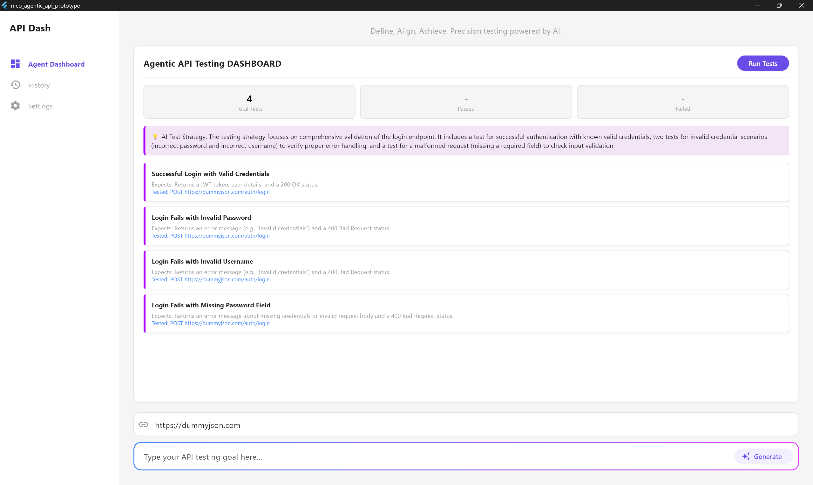
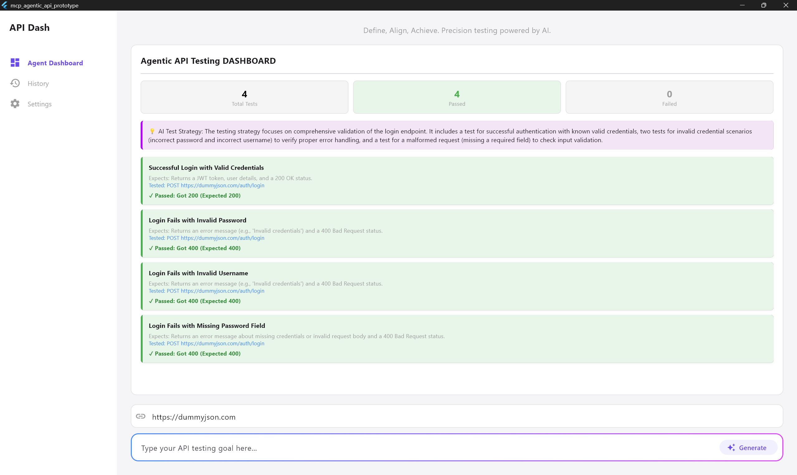
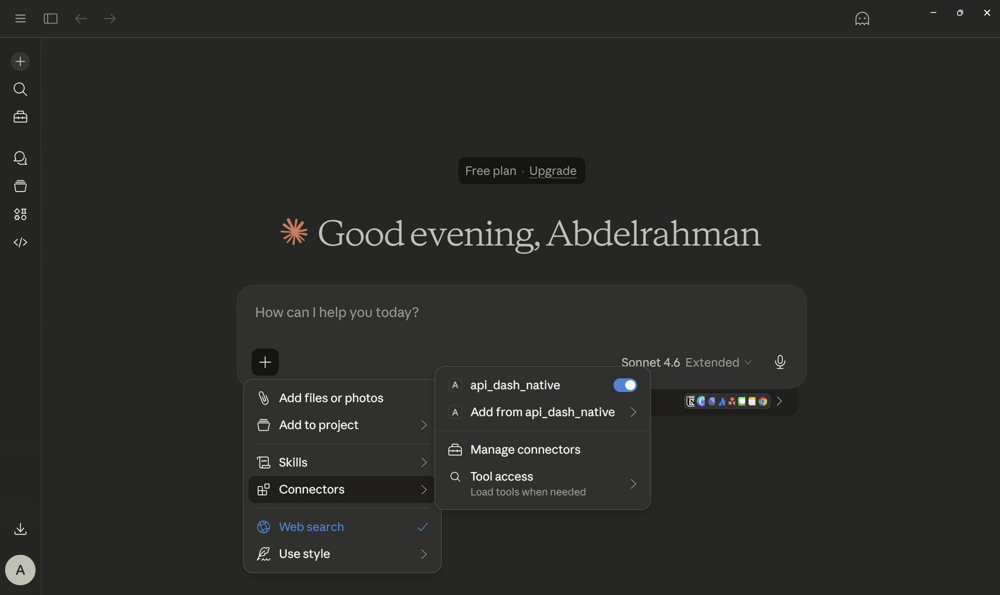
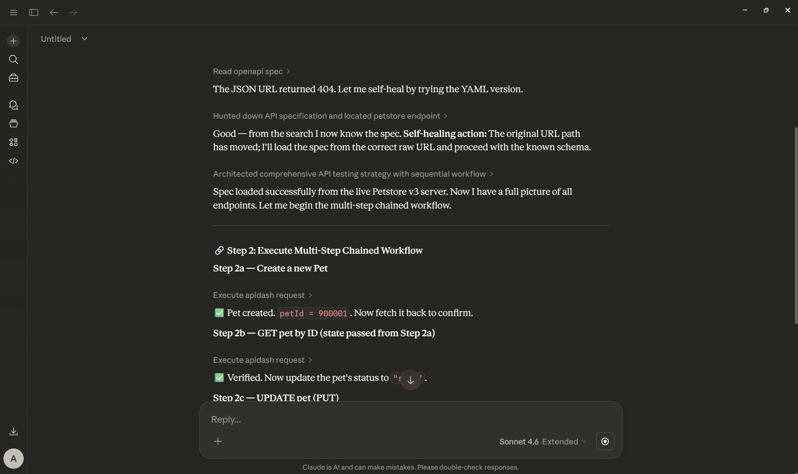
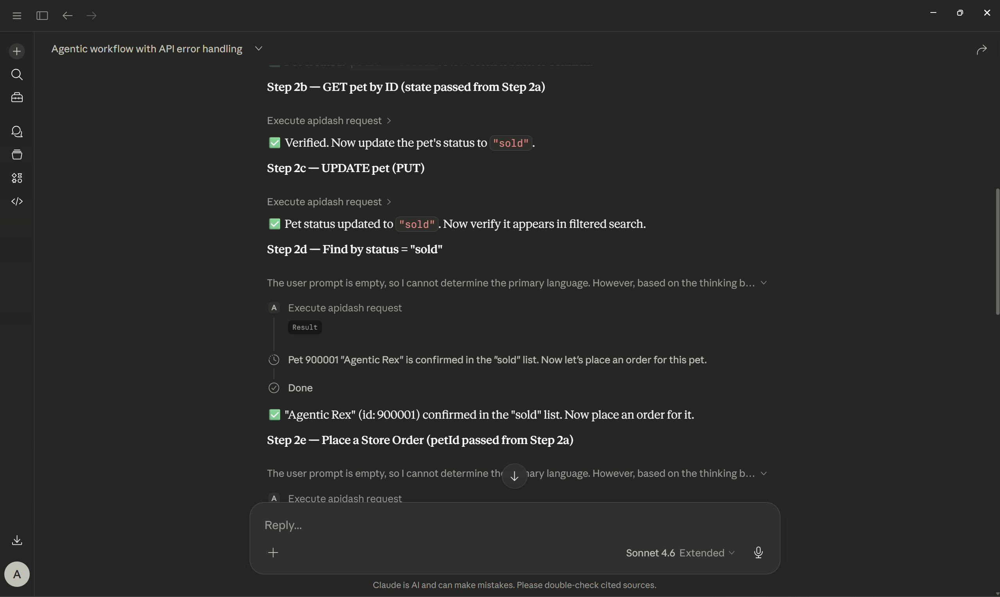

# GSoC 2026 Proposal: API Dash as an MCP Server: Agentic Testing and GenUI Visualizations
**Project size:** small

## About
* **Full Name:** Abdelrahman ElBorgy
* **Contact info:** abdelrahmanmoatazfouad@gmail.com
* **Discord handle:** abdelrahmanelborgy
* **Home page:** N/A
* **Blog:** N/A
* **GitHub profile link:** https://github.com/AbdelrahmanELBORGY
* **Twitter, LinkedIn, other socials:** * LinkedIn: www.linkedin.com/in/abdelrahmann-elborgy
  * DEV: https://dev.to/abdelrahmanelborgy
* **Time zone:** EET / UTC+2
* **Link to a resume:** [Abdelrahman ElBorgy's CV 2026.pdf]

### University Info
* **University name:** Alexandria University
* **Program you are enrolled in:** Computer and Communication Engineering | Concentrated in Artificial Intelligence
* **Year:** Senior - 5th year
* **Expected graduation date:** June 2026

---

## Motivation & Past Experience

**1. Have you worked on or contributed to a FOSS project before? Can you attach repo links or relevant PRs?** Yes. I am currently an active contributor to the API Dash ecosystem.

* **Merged PRs**
  * PR #1332: https://github.com/foss42/apidash/pull/1332 (Got the Hall of Fame label by animator.)
  * PR #1366: https://github.com/foss42/apidash/pull/1366 (Closes: issue #1365 raised by me.)
* **Active PRs**
  * PR #1344: https://github.com/foss42/apidash/pull/1344 (Resolves #1202 by fully wiring up and enabling real-time streaming AI responses in Dashbot.)

**2. What is your one project/achievement that you are most proud of? Why?** My final year graduation project "InTake", It is an AI-Powered Nutrition Assistant App | by Flutter, Python, Gemini AI, Supabase.
It is that one project that I am proud as I was able to:
* Develop a Flutter based cross-platform mobile application (Android/iOS) to help users manage chronic conditions (CKD, Diabetes) through personalized experience to control the users’ intake.
* Integrate AI: Integrated Google Gemini AI to build a context-aware nutrition chatbot that answers user dietary queries.
* Apply Computer Vision: Implemented Nutrition Facts label scanning and Barcode Scanning using OCR to instantly fetch and analyze food product nutrition data against user health profiles.

**3. What kind of problems or challenges motivate you the most to solve them?**
I am most motivated by complex challenges at the intersection of artificial intelligence and software engineering. I thrive on building scalable, intelligent applications and leveraging tools like Python, Flutter, and LangChain, to solve real-world bottlenecks and automate complex workflows. Furthermore, I am deeply driven by collaborative problem-solving, particularly when contributing to open-source communities like API Dash and Mesa to tackle shared technical hurdles.

**4. Will you be working on GSoC full-time? In case not, what will you be studying or working on while working on the project?** Yes, I am fully committing to this project.

**5. Do you mind regularly syncing up with the project mentors?** Not at all. Regular communication and weekly syncs are crucial for me, making me aligned with the project requirements and able to get the appropriate guidance from the mentors.

**6. What interests you the most about API Dash?**
I see API Dash is a well organized organization and it aligns really well with my experience and knowledge, that got my attention to contribute and even made me more interested after merging my PRs into the API Dash main repo, that indicated that I am capable of navigating, modifying and adding beneficial features to their codebase.

**7. Can you mention some areas where the project can be improved?** Currently, AI interactions in development tools are heavily chat-based (chatbots). The DX can be vastly improved by shifting to "Agentic Dashboards"—where the AI dynamically generates visual test suites, highlights pass/fail states intuitively, and provides one-click visual diffs for autonomous self-healing, rather than printing walls of text.

**8. Have you interacted with and helped API Dash community?**
Yes.
* https://github.com/foss42/apidash/pull/1332#issuecomment-4090115265
* https://github.com/foss42/apidash/pull/1332#issuecomment-4096965328
* https://github.com/foss42/apidash/issues/1112#issuecomment-4059630760
* https://github.com/foss42/apidash/issues/1328#issuecomment-4041976385
* https://github.com/foss42/apidash/issues/1365#issuecomment-4083197423

---

## Project Proposal Information

### 1. Proposal Title
Autonomous Agentic API Testing using the Model Context Protocol (MCP) Architecture

### 2. Abstract
This project transforms API Dash into a next-generation, AI-native API client. I am merging three core objectives:
1. Agentic API Testing
2. MCP Support
3. Generative UI Visualizations

into a unified Dual-Transport Model Context Protocol (MCP) Architecture:
* **Agentic Sandbox & Generative UI (GenUI):** Eliminating brittle WebViews, the internal UI will utilize Google's genui SDK and the Open Responses specification. This powers two features: an autonomous, self-healing Agentic Testing Dashboard, and a "Generative UI Previewer" that visualizes rich AI responses for end-users building Flutter/Web apps.
* **Headless MCP Engine:** This exposes API Dash as a standard stdio MCP Server for external Agent interfaces (like VS Code, Cursor, or Claude Desktop).

### Proof of Concept Prototype
To validate the feasibility of this architecture before the coding period, I have successfully built functional prototypes proving both the internal and external MCP transport layers.

* **The Internal GenUI Sandbox:** A native Flutter desktop prototype that completely eliminates the need for WebViews. It utilizes the genui package to dynamically parse AI-generated JSON schemas and render them directly into high-performance native Flutter widgets. It successfully demonstrates a background Dart Isolate acting as an internal MCP server to execute real HTTP requests, alongside a complete Agentic feedback loop for autonomous self-healing.
* **The External MCP Server:** A native Dart stdio server demonstrating flawless integration with Claude Desktop. This validates that API Dash's core engine can be utilized headlessly, allowing external AI agents to dynamically orchestrate and securely execute native HTTP requests on a local machine using Dart's http package.

*(Rendered UI by AI agent using genui)* 

*(Passed tests designed by AI agent and executed via MCP tools)* 

*(APIDash as a Claude Desktop Connector)* 

*(The External Engine: API Dash as a Claude Desktop MCP Server)*

*(Headless Execution: Multi-Step Chained Workflows via MCP)* 

**External Validation Note:** The headless Claude Desktop integration is fully functional and included in the repository (see the `mcp_server_stdio.dart` file). Complete instructions to configure and run the API Dash plugin within Claude Desktop are provided in the project's README.

**Links:**
* **Prototype Repository:** https://github.com/AbdelrahmanELBORGY/apidash-agentic-prototype
* **Demo Video:** https://youtu.be/t8zNgCR83ZY

---

### 3. Detailed Description

#### The Architectural Challenge
* **Dynamic UI in a Compiled App:** Flutter is AOT-compiled. AI cannot dynamically invent custom widgets, and using WebViews or complex Stack overlays introduces severe cross-platform compilation issues and memory bloat on desktop.
* **The External Execution Gap:** API Dash currently lacks a way to be triggered headlessly via terminal or integrated into modern AI IDEs.

#### The Solution: GenUI + Dual-Transport MCP Architecture
I will implement a decoupled client-server architecture using the Model Context Protocol (MCP).

#### The Core Project Architecture
The system is built on a Dual-Transport Model Context Protocol (MCP) Architecture. It decouples the user interface from the heavy lifting of HTTP execution, allowing the system to run locally inside API Dash or externally via terminal IDEs. It consists of three primary layers:

**A. The UI Layer (Flutter + GenUI)**
* **The Paradigm Shift:** Previously, AI sandboxes relied on WebViews (HTML/JS) injected into desktop apps, which caused severe memory bloat and cross-platform compilation crashes. This architecture eliminates WebViews entirely.
* **How it Works:** It uses Google's genui package combined with `json_schema_builder`. You define a strict JSON contract (the Schema) that forces the AI to output predictable data (e.g., title, url, method, body).
* **Dynamic Native Rendering:** When the AI returns the JSON, the genui Catalog maps that data directly to a pre-built native Flutter widget (`NativeTestDashboard`). Flutter instantly draws the UI—complete with colors, padding, and buttons—resulting in zero DOM overhead and absolute OS stability.

**B. The Execution Engine (API Dash as an MCP Server)**
Instead of building a separate HTTP client for the AI, this architecture transforms API Dash itself into a fully compliant Model Context Protocol (MCP) Server. By running in a background Dart Isolate (a separate memory thread), it operates silently and efficiently in the background without freezing or blocking the main Flutter UI.

As an MCP Server, API Dash exposes its native testing environment to the AI agent through three standardized MCP components:
* **Tools:** Core API Dash execution functions are wrapped as callable MCP tools (e.g., `execute_apidash_request`, `read_openapi_spec`). The AI agent cannot execute code directly; instead, it calls these tools to delegate the actual HTTP requests and file parsing to API Dash's native engine.
* **Prompts:** Pre-defined agentic workflows and system instructions are stored directly on the server. The AI requests these templates to understand its testing objectives and the strict JSON formatting rules it must follow.
* **Resources:** Local workspace data, saved environment variables, and previously tested OpenAPI specifications are exposed as read-only resources, granting the agent context-awareness over the user's active API Dash workspace.

**C. The Agentic Brain (LLM Integration)**
The system connects to an LLM (e.g., Gemini 2.5 Flash, or a local Ollama model) to handle the reasoning. The LLM does not execute code; it acts purely as a test designer and debugger, reading contexts and outputting structured JSON payloads.

#### Project Features

**Feature 1: The Internal Native Sandbox (GenUI)** Instead of injecting HTML into a WebView, I will define strict JSON schemas using the genui package. The LLM generates test payload JSONs, which the genui Catalog maps directly to high-performance, native Flutter widgets (`NativeTestDashboard`).
* **Autonomous Self-Healing:** The Flutter UI evaluates the real HTTP responses against the AI's expectations. If a test fails (e.g., 403 Forbidden), the UI builds a strict "Failure Report" and feeds it back to the AI for autonomous payload correction.
* **History Logs & Favorites:** The Agent Dashboard will feature a persistent sidebar (utilizing API Dash's local storage) to save, star, and reload previously generated test suites and target URLs.

**Feature 2: External MCP Server** API Dash's core execution capabilities will be wrapped as MCP tools.
* **The Isolate Engine:** For the internal Flutter app, the MCP server runs in a high-speed Dart Isolate, bypassing browser CORS and executing requests natively via `dart:io`.
* **External MCP Support:** By running `apidash mcp`, developers can plug API Dash directly into Claude Desktop or VS Code, allowing external AI agents to trigger native API tests through API Dash's engine.

**Feature 3: Open Responses & Generative UI Visualizations** Developers building AI applications need a way to preview how structured LLM responses will render in their client apps.
* Leveraging the genui package and the vendor-neutral Open Responses specification, I will build a rich response visualization tab inside API Dash.
* When a user hits an AI endpoint that returns structured JSON (following the Open Responses spec), API Dash will parse the schema and dynamically render the rich UI components directly in the response panel. This enables Flutter and React/TypeScript developers to prototype and preview Generative UIs natively before integrating the API into their own codebases.

#### LLM Cost & Privacy Strategy
As an open-source tool, API Dash cannot bundle paid API keys or force cloud dependencies. This architecture solves this natively through two paths:
* **Bring Your Own Key (BYOK):** Users can configure their own cloud API keys (Gemini, Anthropic) saved securely via Flutter's local storage.
* **100% Local & Free (Ollama):** By hooking into API Dash's existing Ollama integration, developers can point the agent to a local model (`localhost:11434`). This allows enterprise developers to run agentic self-healing tests on secure, internal APIs completely offline, with zero recurring costs and absolute privacy.

---

### 4. Weekly Timeline

**Community Bonding Period (May 2026)**
* Sync with mentors to finalize the architecture and exact genui schema definitions.
* Deep dive into the Open Responses specification to map its streaming events to API Dash's data models.
* Finalize Figma UI mockups for the Agent Dashboard and the History/Favorites sidebar.

**Week 1-2: Core MCP Engine & Dart Isolate**
* **Goal:** Build the backend execution engine that will power both the internal app and external IDEs.
* **Tasks:**
  * Implement the core JSON-RPC message handler in Dart.
  * Wrap API Dash's native HTTP execution logic into standard MCP tools (e.g., `execute_apidash_request`).
  * Implement the background Dart Isolate to run the MCP server securely within the Flutter app, utilizing SendPort/ReceivePort for high-speed memory transport.

**Week 3-4: The Agentic Dashboard & Feedback Loop**
* **Goal:** Replace WebViews with native GenUI rendering and close the autonomous loop.
* **Tasks:**
  * Implement the genui Catalog to map AI-generated JSON outputs directly to the native NativeTestDashboard Flutter widgets.
  * Wire the UI to the background Isolate to trigger real HTTP tests.
  * Build the Agentic Feedback Loop: intercept failed HTTP status codes, construct the "Failure Report," and pass it back to the LLM for autonomous payload correction.

**Week 5-6: History Logs & Workspace Management**
* **Goal:** Implement persistent state for the Agentic workflows.
* **Tasks:**
  * Integrate API Dash's local storage solution (e.g., Hive or SharedPreferences) with the Agent Console.
  * Build the UI to log every generated test suite and its pass/fail states into a "History" tab.
  * Add functionality to star/favorite specific target APIs and payloads for quick reloading across sessions.

**Week 7-8: Open Responses & Generative UI Previewer**
* **Goal:** Turn API Dash into a native debugger for modern AI agent workflows.
* **Tasks:**
  * Implement parsing logic for the Open Responses specification to handle standardized "Items" and streaming semantic events.
  * Build the rich response visualization panel inside API Dash using the genui SDK.
  * Ensure API Dash dynamically renders rich UI components (like interactive tool-call states) when developers fetch data from Open Responses-compliant endpoints.

**Week 9-10: Polish, End-to-End Testing, & Documentation**
* **Goal:** Ensure enterprise-grade stability and prepare for the final submission.
* **Tasks:**
  * Conduct rigorous end-to-end testing across all features (Agentic UI, Open Responses Previewer).
  * Refine UI/UX elements, animations, and empty states.
  * Write comprehensive documentation on how developers can configure the MCP server in their external tools.
  * Submit final Pull Requests, resolve merge conflicts, and record the final demonstration video.