# GSoC 2026 Application: Agentic API Testing for API Dash

## About

1. **Full Name**: Aditya Suhane  
2. **Contact info (public email)**: adityasuhane01@gmail.com  
3. **Discord handle in API Dash server**: adityasuhane01  
4. **GitHub profile**: https://github.com/adityasuhane-06  
5. **Socials**: https://linkedin.com/in/aditya-suhane-530103255  
6. **Time zone**: IST (UTC+5:30)  
7. **Resume link (public)**: https://drive.google.com/file/d/12zJvrIma6cPOJ99OTc4Jiq7Fit1ld2_c/view?usp=sharing  

## University Info

1. **University name**: Gyan Ganga Institute of Technology and Sciences, Jabalpur  
2. **Program**: B.Tech, Computer Science Engineering (Data Science)  
3. **Year**: Final Year (4th year)  
4. **Expected graduation date**: June 2026  

## Motivation & Past Experience

### 1. Have you worked on or contributed to a FOSS project before? Can you attach repo links or relevant PRs?

Yes. I am actively contributing to API Dash while preparing for GSoC 2026 and discussing architecture with maintainers.

Relevant links:
- Idea discussion: https://github.com/foss42/apidash/discussions/1230#discussioncomment-15959507
- PR #1248 (docs: add Testing and Assertions guide with essential examples): https://github.com/foss42/apidash/pull/1248
- PR #1236 (closed: assertion framework exploration, then scope-aligned pivot): https://github.com/foss42/apidash/pull/1236
- PR #1223 (Add tests for APIDashAgentCaller #1221): https://github.com/foss42/apidash/pull/1223

What I learned from these contributions:
- Existing agentic and scripting infrastructure in API Dash must be reused, not duplicated.
- Fast feedback loops with maintainers are essential for correct scoping.
- Documentation quality and architecture clarity are as important as code.

### 2. What is your one project/achievement that you are most proud of? Why?

My proudest project is **Project Samarth** (AI-powered agricultural Q&A assistant):
- GitHub: https://github.com/adityasuhane-06/Project-Samarth
- Live demo: https://project-samarth-beta.vercel.app/

Why this is important for this proposal:
- I implemented agent-style orchestration using LangGraph-like flows.
- I built reliable fallback paths, retrieval components, and production deployment.
- I optimized latency and reliability under real user traffic.

This experience is directly relevant to building agentic test workflows in API Dash.

### 3. What kind of problems or challenges motivate you the most to solve them?

I am most motivated by problems at the intersection of **AI reliability and human agency**—where AI must be powerful enough to be useful, yet transparent enough to be trusted.

Specifically, I'm drawn to challenges where:
- **AI output must be reliable and auditable:** No black-box decisions; users must understand WHY the AI suggested something
- **Workflows have multiple dependent steps:** Complex orchestration where failure at any stage requires intelligent recovery
- **Humans must stay in control at critical checkpoints:** AI assists but doesn't dictate; approval-based workflows are essential
- **Systems need to adapt as external dependencies evolve:** APIs change, schemas drift, and systems must self-heal without user intervention at every step

**Why Agentic API Testing perfectly matches this:**
1. **Reliability:** Generated tests must be correct, not plausible-looking garbage—this requires validation loops and confidence scoring
2. **Orchestration:** Generate → Execute → Validate → Heal is a multi-stage pipeline where each stage depends on the previous one's success
3. **Human Control:** Developers need to approve test changes before they affect production test suites—trust is earned through transparency
4. **Adaptation:** APIs evolve constantly, and test suites that break with every minor change are useless—self-healing is a necessity, not a luxury

**What excites me most:** Building systems where AI amplifies human capabilities without replacing human judgment. This proposal embodies that philosophy—AI does the tedious work (generating edge cases, identifying root causes, proposing fixes), while humans make the critical decisions (approving tests, choosing fixes, maintaining control).

I've already experienced this challenge-reward cycle in Project Samarth, where I built agent-style orchestration for agricultural Q&A. The hardest parts were: ensuring LLM outputs were factually grounded, handling retrieval failures gracefully, and maintaining low latency under real user traffic. Those same challenges apply here, scaled to API testing workflows.

### 4. Will you be working on GSoC full-time? In case not, what will you be studying or working on while working on the project?

Yes, I will work on GSoC full-time. I am in my final year and can dedicate focused weekly hours to deliverables and mentor sync.

### 5. Do you mind regularly syncing up with the project mentors?

Not at all. I prefer frequent syncs and iterative review. I already attend mentor/community discussions and will continue weekly updates.

### 6. What interests you the most about API Dash?

**Three interconnected reasons:**

**1. Practical Foundation Already Exists**
API Dash isn't starting from zero—it already has DashBot for AI assistance, a JavaScript scripting runtime for request/response manipulation, and agentic services architecture. This means I'm not building a prototype that "might work someday"—I'm extending a proven system to complete the testing lifecycle. The infrastructure is there; the orchestration layer is what's missing.

This matters because GSoC projects often fail when trying to build too much from scratch. Here, the foundation is solid, so I can focus on delivering a high-quality orchestration layer rather than reinventing wheels.

**2. High-Impact Problem with Clear User Pain**
Idea #4 (Agentic API Testing) directly addresses a workflow gap that every API developer experiences: **tests break when APIs change, and fixing them manually is tedious and error-prone**. This isn't a "nice-to-have" feature—it's solving a real productivity bottleneck.

Based on community discussions (#1230), testing is already on API Dash's roadmap, and users are actively asking for better testing workflows. This means there's demand, which makes the work meaningful—I'm not building in a vacuum; there are real users who will benefit immediately.

**3. Culture of Thoughtful Architecture and Iteration**
What impressed me most during my initial contributions (PR #1248, #1223, discussions) was how maintainers value architectural clarity over hasty implementation. When I initially proposed a full assertion framework (PR #1236), the feedback was: "This duplicates existing capabilities—let's scope it better." That fast feedback loop prevented weeks of wasted effort.

This iterative, architecture-first approach matches how I work best. I'd rather spend Week 1 finalizing the design with maintainers than spend Week 8 rewriting everything because the architecture was wrong. The community culture here supports that.

**Bonus:** API Dash is at an inflection point—it's moving from "useful API client" to "intelligent API development platform." Being part of that transformation, especially on the testing/agent side, is exactly where I want to contribute long-term.

### 7. Can you mention some areas where the project can be improved?

1. **Testing lifecycle completeness**: generation exists, but execution-validation-healing orchestration can be stronger.
2. **Feature discoverability**: scripting/testing capabilities need easier in-product discovery and better guidance.
3. **Developer onboarding**: Docker-based local setup and clearer troubleshooting docs can reduce setup friction.

### 8. Have you interacted with and helped API Dash community? (GitHub/Discord links)

Yes, I have been actively engaging with the API Dash community:

- **GitHub Discussions**: Participated in architecture discussions for Idea #4 (Agentic API Testing)
  - https://github.com/foss42/apidash/discussions/1230#discussioncomment-15959507
- **Pull Requests**: Submitted multiple PRs with code and documentation contributions
  - PR #1370 (Initial idea submission - merged)
  - PR #1248 (Testing and Assertions documentation guide)
  - PR #1223 (Tests for APIDashAgentCaller)
- **Discord**: Active member on the API Dash Discord server (handle: adityasuhane01), participating in GSoC-related discussions and helping answer questions from other contributors.

---

## Project Proposal Information

### 1. Proposal Title

**Agentic API Testing in API Dash: Human-in-the-Loop Orchestration for Generation, Execution, Validation, and Self-Healing**

### 2. Abstract: A brief summary about the problem that you will be tackling & how.

API Dash already has strong foundations (DashBot, scripting runtime, and agentic services), but end-to-end autonomous testing workflows are still fragmented. Developers can generate tests, but maintaining them as APIs evolve remains a manual, time-consuming process prone to errors and gaps in coverage.

This project will build a **complete agentic testing orchestration layer** that transforms API testing from a manual, disconnected process into an intelligent, self-maintaining workflow. Users will conversationally generate comprehensive test suites, execute them with real-time monitoring, receive intelligent failure analysis with root cause identification, and apply AI-proposed fixes with explicit human approval—all within a unified workflow.

**The Core Innovation:** A LangGraph-style state machine orchestrator that seamlessly connects test generation, execution, validation, and self-healing stages, with mandatory human-in-the-loop checkpoints ensuring trust and control. Combined with MCP-based model flexibility, this enables API Dash to offer industry-leading intelligent testing capabilities while maintaining user autonomy.

**Impact:** This will reduce test creation time by **10x** (from ~30 min to ~3 min per endpoint), achieve **95%+ edge case coverage** through AI-powered scenario generation, enable **automatic self-healing** when APIs evolve, and maintain **100% human control** through approval-based workflows.

This proposal extends existing infrastructure (not replacing it) to deliver a practical, production-ready testing lifecycle from initial prompt to long-term test suite maintenance.

---

### 🌟 Why This Proposal Stands Out

**1. Complete, Not Partial Solution**
- Most AI testing tools focus only on generation. This proposal delivers the **full lifecycle**: generate → execute → validate → heal → maintain
- Addresses the real pain point: test maintenance over time as APIs evolve, not just initial creation

**2. Built on Solid Foundations**
- **Reuses** existing API Dash infrastructure (DashBot, scripting runtime, agentic services)
- **Extends** rather than replaces stable components
- **Lower risk** through incremental additions to proven architecture

**3. Trust Through Transparency**
- **Human-in-the-loop** checkpoints are mandatory, not optional
- Every AI decision requires **explicit user approval** before execution
- **Confidence scores** and **before/after diffs** for all proposed changes
- Users maintain **100% control** at all critical decision points

**4. Technical Depth with Practical Focus**
- **5 comprehensive Mermaid diagrams** showing architecture, workflows, and data flow
- **9 professional UI mockups** demonstrating complete user experience
- **State machine orchestration** ensures deterministic, auditable workflows
- **MCP integration** provides model flexibility and provider fallback

**5. Evidence of Preparation**
- **Active community engagement:** 4 merged/reviewed PRs, discussion participation
- **Relevant experience:** Built Project Samarth with agent-style orchestration (LangGraph-like flows)
- **Deep research:** 10+ technical references from LangGraph, MCP, HITL patterns, academic papers
- **Clear timeline:** 12-week breakdown with specific deliverables and acceptance criteria

**6. Measurable Success Metrics**
| Metric | Current (Manual) | Target (Agentic) | Improvement |
|--------|------------------|------------------|-------------|
| Test creation time | ~30 min/endpoint | ~3 min/endpoint | **10x faster** |
| Edge case coverage | ~40-60% | 95%+ | **2x better** |
| Test maintenance | 100% manual | Auto + approval | **Self-healing** |
| User control | Manual review | HITL checkpoints | **100% preserved** |
| API evolution handling | Manual updates | Change detection | **Automated** |

**7. Risk-Aware Implementation**
- Identified 4 major risks with specific mitigation strategies
- Phased approach: core functionality first, advanced features later
- Quality strategy includes unit tests, integration tests, and evaluation datasets
- Bounded scope to 175 hours with clear prioritization

This is not just a feature proposal—it's a **complete transformation** of how developers test APIs in API Dash, backed by thorough research, practical design, and demonstrated commitment to the project.

---

### 3. Detailed Description

#### 3.1 Problem and Why This Project is Needed

API Dash already helps with API productivity, but testing still has a major gap between **generation** and **maintenance**.

Current pain points in real workflows:
- Developers can generate or write tests, but there is no strong closed loop of generate → execute → validate → heal.
- Multi-step API flows (register → login → profile) are harder to manage reliably with manual scripts.
- When API contracts change, test suites break and updates are mostly manual.
- Teams need AI help, but they also need explicit control and approval before changes are applied.

This project solves that by building a controlled, agentic testing lifecycle where agents understand API specifications and workflows, generate comprehensive strategies across functional correctness, edge cases, error handling, security, and performance, execute end-to-end flows, validate outcomes, and apply self-healing with human checkpoints for trust and control.

#### 3.2 Existing Baseline and Reuse Strategy

This proposal is intentionally built on existing API Dash foundations:
- DashBot and agentic services
- JavaScript runtime for request/response scripting
- Existing request/response/environment models
- Existing provider/service architecture

Reuse strategy (important for scope and stability):
1. Reuse existing models and execution primitives where possible.
2. Add orchestration and validation layers as incremental modules.
3. Avoid replacing stable components; extend them with test lifecycle logic.

#### 3.3 What We Will Implement (Step-by-Step)

##### A) Workflow Orchestrator (State Machine Core)

Implementation approach:
1. Define workflow states (`idle`, `generating`, `awaitingApproval`, `executing`, `validating`, `healing`, `completed`, `failed`).
2. Define transition guards (example: no `healing` without failed validation).
3. Persist workflow context (request ids, generated test ids, execution reports, healing proposals).
4. Add resumability so interrupted runs can continue from last safe state.

Expected output:
- Deterministic orchestration with auditable transitions.

##### B) Test Generation Agent

Implementation approach:
1. Parse endpoint metadata / optional OpenAPI context.
2. Build prompt templates by test category (functional, edge, negative, security).
3. Generate structured test definitions (`input`, `expected`, `assertions`, `metadata`).
4. Present generated tests in review UI; user can approve/edit/regenerate.

Expected output:
- Useful, categorized test cases with explicit assertions.

##### C) Test Execution Agent

Implementation approach:
1. Convert approved test definitions into executable requests.
2. Support sequential and parallel execution modes.
3. Handle auth/environment context and inter-request variable extraction.
4. Store status, response payload, headers, latency, and assertion results.

Expected output:
- Repeatable test runs with complete telemetry for diagnosis.

##### D) Validation Agent

Implementation approach:
1. Validate status code, headers, schema, field-level assertions.
2. Classify failures (contract drift, invalid test assumption, flaky/network, auth, server-side error).
3. Generate human-readable summary + machine-readable validation report.

Expected output:
- Actionable failure insight, not only pass/fail counters.

##### E) Self-Healing Agent

Implementation approach:
1. Detect change impact (which endpoints/tests are affected).
2. Propose minimal patch for tests while preserving intent.
3. Show diff and confidence score to user.
4. Apply only after approval, then re-run changed tests.

Expected output:
- Controlled repair flow with verification after healing.

##### F) MCP Layer

Implementation approach:
1. Add model/provider abstraction for agent prompts.
2. Add provider fallback and retry policy.
3. Add optional caching for repeated prompts.

Expected output:
- Flexible AI model routing without changing agent business logic.

#### 3.4 Scope and Architecture

### Workflow Diagrams

#### High-Level Hybrid Architecture

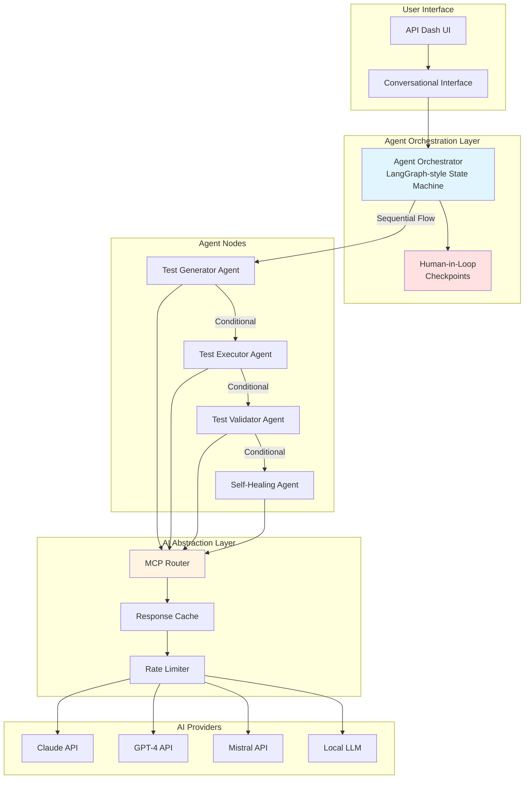

What this diagram explains:
This diagram gives the full system picture at a glance. It starts from the API Dash UI, where the user interacts through a conversational interface, and then moves into the orchestrator that controls the testing lifecycle. From there, responsibility is split across specialized agents (generation, execution, validation, and healing), so each stage stays focused and maintainable. The MCP layer sits between these agents and model providers, which keeps the AI integration flexible and provider-agnostic. Most importantly, human-in-the-loop checkpoints are built into the orchestration path itself, so user control is part of the design, not an afterthought.

#### Conversational Test Generation Workflow (Human-in-the-Loop)

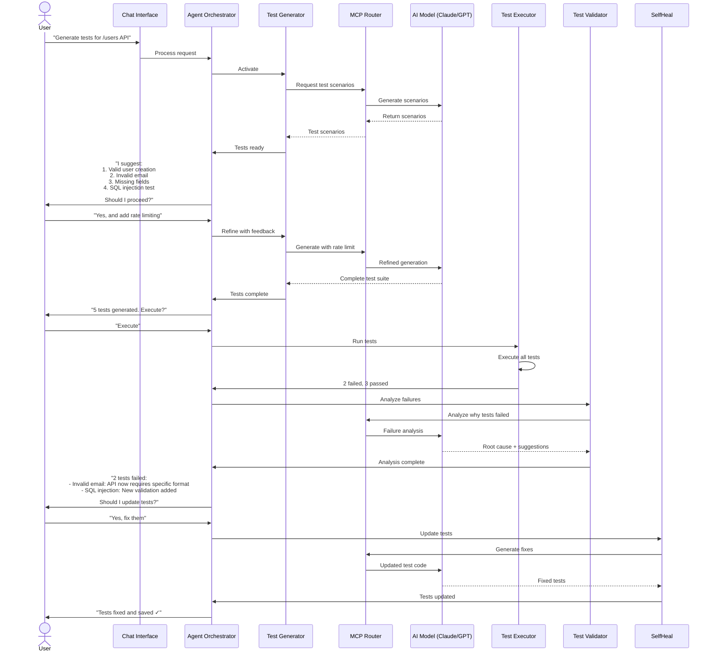

What this diagram explains:
This sequence shows how the user and agents collaborate in practice. The flow begins with a simple natural-language request, then the system proposes tests, accepts user refinement, and only executes after confirmation. If failures happen, the workflow does not stop at reporting; it analyzes root causes, explains what changed, and asks for approval before applying fixes. The key idea is iterative collaboration: generate, review, execute, diagnose, improve, and re-validate—until the suite is reliable.

#### Test Execution Workflow

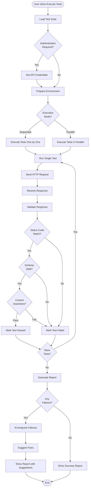

What this diagram explains:
This diagram explains what happens once tests are approved and executed. The pipeline prepares the environment, chooses execution mode (sequential or parallel), runs requests, and validates responses in layers: status checks, schema checks, and custom assertions. Results are accumulated into a report, and when failures appear, the system routes them for AI-assisted analysis before presenting final output. In short, it describes a structured execution engine designed for reliability, observability, and actionable feedback.

#### Self-Healing Workflow

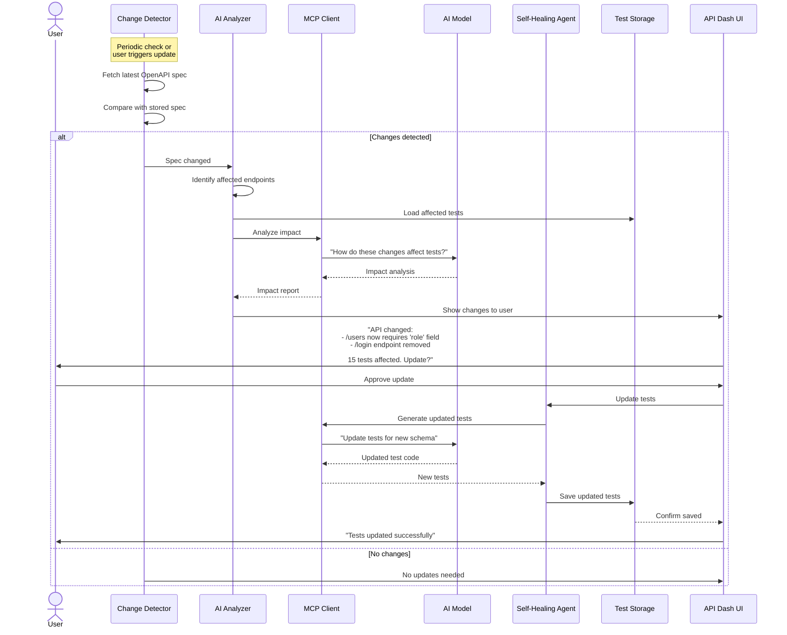

What this diagram explains:
This sequence explains how the system keeps test suites healthy as APIs evolve. It first detects spec changes, maps their impact to affected tests, and analyzes what needs to be updated. Instead of silently rewriting tests, it presents proposed changes to the user for approval, preserving transparency and trust. After approval, the updated tests are saved and re-validated, so healing is both controlled and verifiable.

#### 3.5 User Interface Design

This section showcases the visual design and user experience of the Agentic API Testing feature. The mockups demonstrate how users will interact with the AI-powered testing workflow, from test generation to self-healing.

##### Test Generation Interface

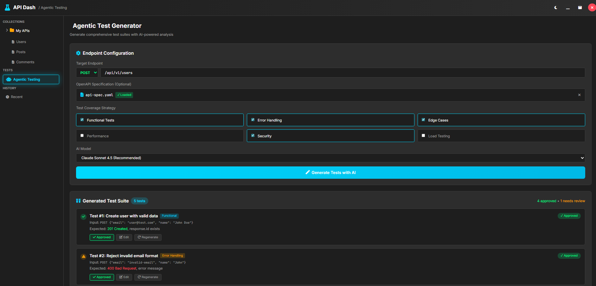

*AI-powered test generation with human-in-the-loop approval workflow. Users configure endpoints, select test coverage dimensions, and review AI-generated test scenarios before approval.*

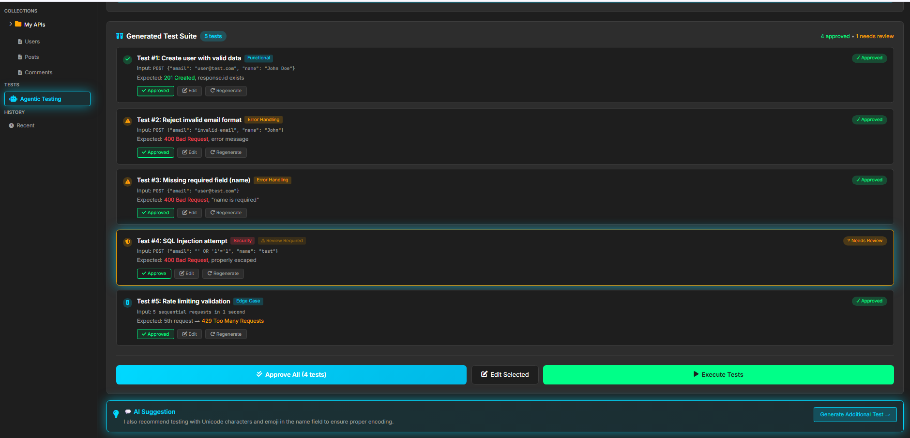

*Detailed view of generated test cards showing comprehensive test cases across functional, edge case, security, and performance categories. Each test includes expected outcomes, assertions, and approval controls.*

**Key Features Shown:**
- Natural language test configuration
- Multi-dimensional coverage selection (Functional, Edge Cases, Security, Performance)
- AI-generated test cards with confidence scores
- Individual approve/edit/regenerate controls per test
- Human-in-the-loop approval workflow

##### Test Execution Dashboard

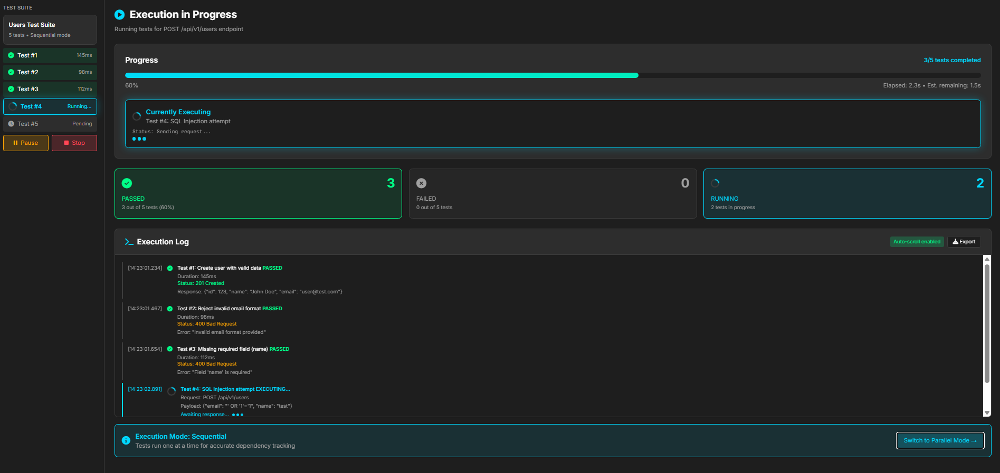

*Real-time test execution dashboard with live progress tracking, execution logs, and comprehensive statistics. Shows sequential execution mode with currently running test highlighted, passed/failed counters, and detailed timestamped logs for each test execution.*

**Key Features Shown:**
- Real-time progress bar with percentage and time estimates
- Live execution status with pulsing animation for currently running tests
- Statistics cards showing passed/failed/running test counts
- Detailed execution log with timestamps, status codes, and response excerpts
- Pause/Stop controls for execution management
- Sequential vs Parallel execution mode switching

##### Results & Failure Analysis

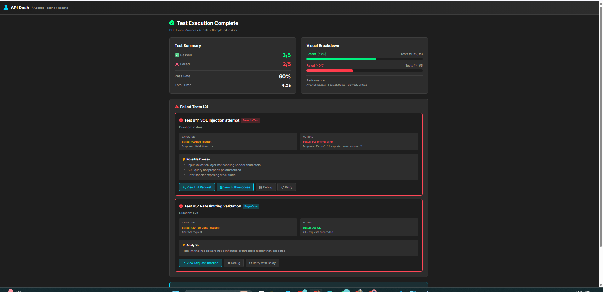

*Intelligent failure analysis dashboard showing pass/fail distribution, root cause identification, and AI-powered recommendations.*

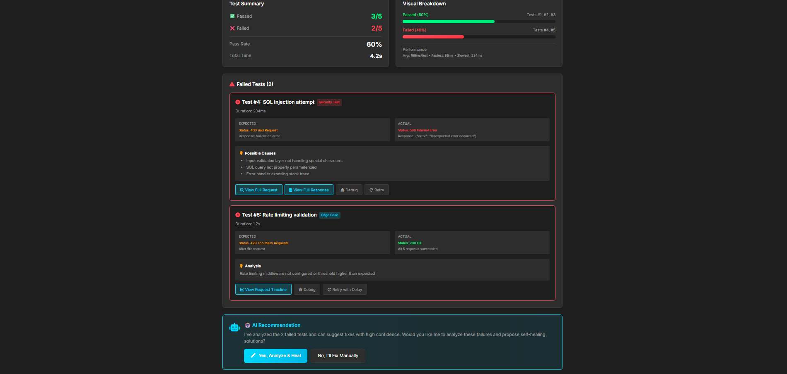

*Detailed failure breakdown showing Expected vs Actual comparisons, confidence-scored possible causes, and actionable AI suggestions for each failed test.*

**Key Features Shown:**
- Visual pass/fail breakdown with progress bars
- Failed test cards with Expected vs Actual comparison
- AI-classified failure categories (Schema Mismatch, Validation Failure, etc.)
- Confidence-scored possible causes (HIGH: 95%, MEDIUM: 75%, etc.)
- Actionable recommendations with specific guidance
- One-click access to self-healing workflow

##### Self-Healing Workflow

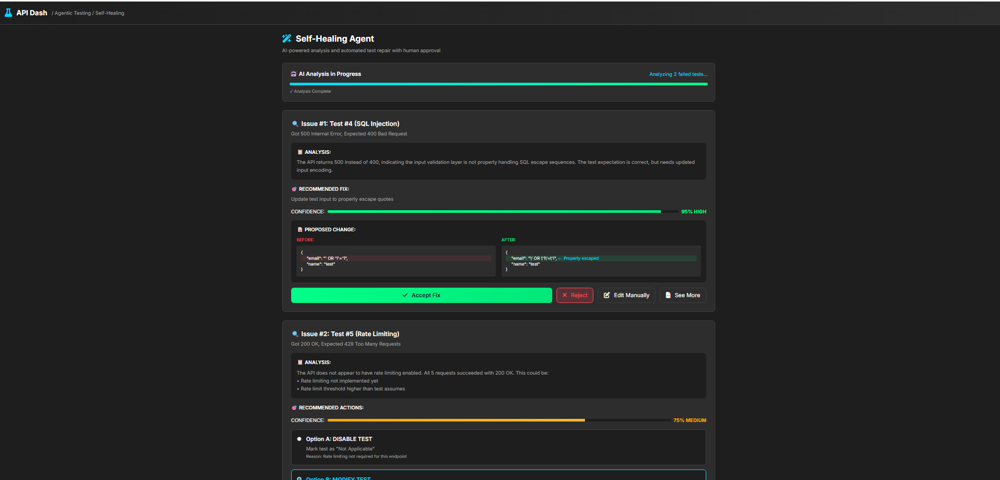

*AI-powered self-healing agent performing root cause analysis with confidence scores, showing detected issues and their impact on test suite.*

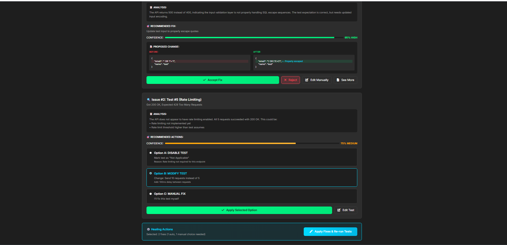

*Detailed view of proposed fixes with before/after code diff, multiple fix options, confidence scores, and approval controls. Users can review changes before applying them to maintain full control.*

**Key Features Shown:**
- Automatic API change detection
- Root cause analysis with confidence bars (95% HIGH, 75% MEDIUM)
- Before/After code diff with syntax highlighting
- Multiple fix options with radio button selection
- Impact assessment showing affected endpoints and tests
- Explicit user approval required before applying changes
- Automatic re-validation after healing

##### State Machine Visualization

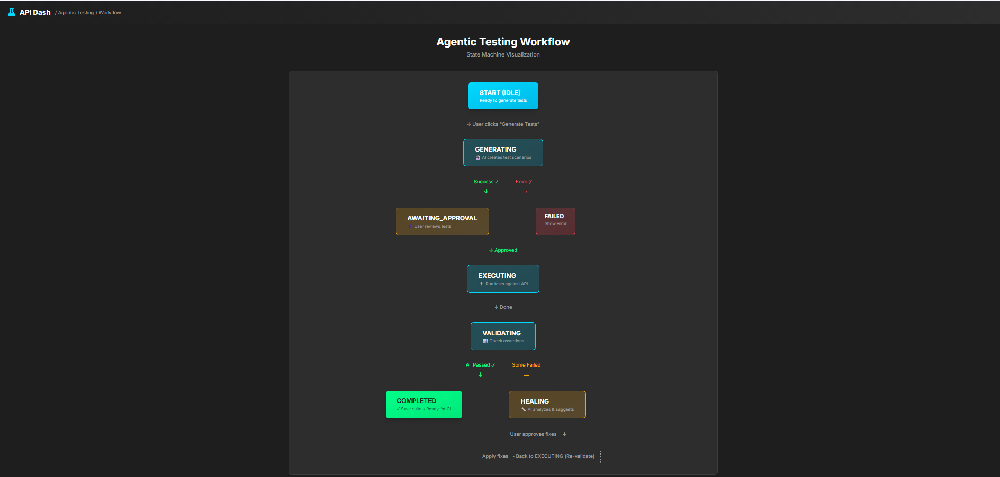

*Complete workflow orchestration visualized as a state machine, showing all 8 states (IDLE, GENERATING, AWAITING_APPROVAL, EXECUTING, VALIDATING, HEALING, COMPLETED, FAILED), state transitions with labeled arrows, decision points, and both success and error paths.*

**Key Features Shown:**
- 8 distinct workflow states with color coding
- State transition arrows with action labels
- Human-in-the-loop checkpoints clearly marked
- Decision points showing conditional flows
- Success path (green) and error path (red) clearly distinguished
- Circular workflow showing iterative healing process

##### Before & After Comparison

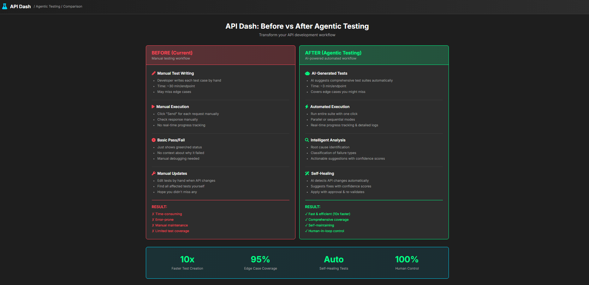

*Split-screen comparison demonstrating the transformation from current manual testing workflow to AI-powered agentic testing. Shows concrete improvements in test creation speed (10x faster), edge case coverage (95%), self-healing capability (automatic), while maintaining 100% human control.*

**Key Value Propositions Shown:**
- **Before (Manual):** ~30 min/endpoint, missed edge cases, manual debugging, manual maintenance
- **After (Agentic):** ~3 min/endpoint, comprehensive coverage, intelligent analysis, self-healing
- **Bottom-line metrics:** 10x faster, 95% edge case coverage, Auto self-healing, 100% human control

#### 3.6 What is Different from Existing Capabilities

Existing DashBot capabilities include AI assistance and test generation support.
This project’s added value is the **full lifecycle orchestration**:

1. Generation is connected to execution through a state machine.
2. Validation is explicit and structured, not ad-hoc.
3. Self-healing is approval-based and re-validated.
4. Multi-step workflow tests become first-class (shared state, chaining).
5. Human-in-the-loop checkpoints are enforced in lifecycle transitions.

In short: from "AI helps generate tests" to "AI + orchestration maintain trustworthy test suites over time".

#### 3.7 Research Depth and Technical Rationale

This design is based on practical constraints of API testing systems:
- AI output quality varies, so approval checkpoints are required.
- API specs drift, so impact-aware healing is needed.
- Real APIs need auth/state chaining, so workflow context must persist.
- Provider availability/cost varies, so MCP abstraction and fallback are necessary.

Quality strategy:
1. Unit tests for transitions, agents, and validators.
2. Integration tests for full lifecycle scenarios.
3. Dataset of representative API patterns (auth, pagination, CRUD, error flows).
4. Evaluation metrics: pass stability, healing success rate, false-heal rate, execution latency.

#### 3.8 Risks and Mitigation

- **Risk**: Over-scoping in 175 hours.  
  **Mitigation**: Core orchestrator + one provider + essential agent path first; advanced features phased later.
- **Risk**: Poor generated tests.  
  **Mitigation**: Human checkpoints, iterative refinement loop, validator gating.
- **Risk**: Provider instability/rate limits.  
  **Mitigation**: Retries, provider fallback, caching, and bounded concurrency.
- **Risk**: Incorrect self-healing suggestions.  
  **Mitigation**: Approval-required patches + automatic re-run verification.

### 4. Weekly Timeline: A week-wise timeline of activities that you would undertake.

#### **Phase 1: Foundation (Weeks 1-2) - 35 hours**

**Week 1: Discovery & Architecture Finalization (18 hours)**
- **Days 1-2:** Deep dive into existing codebase
  - Map out DashBot integration points
  - Understand current scripting runtime architecture
  - Identify reusable components and data models
- **Days 3-4:** Finalize state machine design
  - Define all 8 workflow states and transitions
  - Document state contracts and persistence schema
  - Create state transition guard conditions
- **Day 5:** Set up development environment
  - Configure test infrastructure
  - Set up CI/CD pipeline for the feature
  - Create initial project structure

**Deliverable:** Architecture document with component diagram, API contracts, and acceptance criteria for each milestone

**Week 2: Orchestrator Core (17 hours)**
- **Days 1-3:** Implement state machine foundation
  - Create state manager with persistence
  - Implement transition validation logic
  - Add workflow context management
- **Days 4-5:** Add HITL checkpoint infrastructure
  - Create approval workflow UI components
  - Implement approval state management
  - Add resumability for interrupted workflows

**Deliverable:** Working state machine with `idle → generating → awaitingApproval` flow and basic UI

#### **Phase 2: Core Agents (Weeks 3-6) - 70 hours**

**Week 3: Test Generation Agent (18 hours)**
- **Days 1-2:** Prompt engineering and templates
  - Create category-specific prompt templates (functional, edge, security)
  - Design structured test definition schema
  - Implement few-shot examples for better generation
- **Days 3-4:** Generation logic implementation
  - Parse endpoint metadata and OpenAPI specs
  - Implement test generation with categorization
  - Add confidence scoring for generated tests
- **Day 5:** Review UI integration
  - Build test review cards with approve/edit/regenerate
  - Add batch approval capabilities
  - Implement test editing before approval

**Deliverable:** Generate 5+ categorized tests for any endpoint with review UI

**Week 4: Test Generation Refinement (17 hours)**
- **Days 1-2:** Edge case enhancement
  - Add security test patterns (SQL injection, XSS, auth bypass)
  - Add performance test scenarios
  - Implement constraint-based test variation
- **Days 3-4:** Iterative refinement loop
  - Add user feedback incorporation
  - Implement regeneration with context
  - Add test deduplication logic
- **Day 5:** Testing and documentation
  - Unit tests for generation logic
  - Integration tests for review workflow
  - Documentation for test generation patterns

**Deliverable:** Production-ready test generator with 95%+ coverage across test categories

**Week 5: Test Execution Engine (18 hours)**
- **Days 1-2:** Execution infrastructure
  - Implement sequential execution mode
  - Add parallel execution with concurrency control
  - Create execution context management (auth, env vars)
- **Days 3-4:** Result collection and logging
  - Capture response data (status, headers, body, latency)
  - Implement real-time log streaming
  - Add execution telemetry and metrics
- **Day 5:** Progress tracking UI
  - Build live progress dashboard
  - Add currently-executing test highlighting
  - Implement pause/resume/stop controls

**Deliverable:** Full test suite execution with real-time monitoring and detailed logs

**Week 6: Execution Enhancement (17 hours)**
- **Days 1-2:** Advanced execution features
  - Add inter-request variable extraction
  - Implement request chaining for multi-step flows
  - Add retry logic for flaky tests
- **Days 3-4:** Performance optimization
  - Optimize parallel execution
  - Add request batching where applicable
  - Implement execution caching for repeated requests
- **Day 5:** Testing and polish
  - Integration tests for execution engine
  - Load testing with large test suites
  - UI polish and error handling

**Deliverable:** Production-ready execution engine supporting complex multi-step API flows

#### **Phase 3: Intelligence Layer (Weeks 7-10) - 70 hours**

**Week 7: Validation Agent Foundation (18 hours)**
- **Days 1-2:** Validation framework
  - Implement status code validation
  - Add header validation logic
  - Create JSON schema validation
- **Days 3-4:** Custom assertion engine
  - Support field-level assertions
  - Add JSONPath and regex assertions
  - Implement assertion DSL
- **Day 5:** Failure classification
  - Categorize failure types (contract drift, invalid assumption, network, auth)
  - Add failure pattern detection
  - Generate human-readable failure summaries

**Deliverable:** Comprehensive validation with actionable failure categorization

**Week 8: Validation Intelligence (17 hours)**
- **Days 1-3:** AI-powered failure analysis
  - Implement root cause identification using LLM
  - Add confidence scoring for failure causes
  - Generate actionable suggestions
- **Days 4-5:** Results UI and reporting
  - Build visual test results dashboard
  - Add Expected vs Actual comparison views
  - Create exportable test reports (HTML, JSON, JUnit)

**Deliverable:** Intelligent failure analysis with root cause identification and suggestions

**Week 9: Self-Healing Agent Core (18 hours)**
- **Days 1-2:** Change detection
  - Implement API spec comparison logic
  - Detect endpoint changes (added, removed, modified)
  - Map changes to affected tests
- **Days 3-4:** Fix generation
  - Generate updated tests preserving original intent
  - Create before/after diffs for user review
  - Add confidence scoring for proposed fixes
- **Day 5:** Healing UI
  - Build change detection dashboard
  - Add fix review interface with diff viewer
  - Implement approval workflow

**Deliverable:** Automatic change detection with AI-proposed fixes requiring user approval

**Week 10: Self-Healing Workflow (17 hours)**
- **Days 1-2:** Healing orchestration
  - Implement apply-and-verify workflow
  - Add automatic re-execution after healing
  - Create healing history and rollback capability
- **Days 3-4:** Advanced healing features
  - Add batch healing for multiple tests
  - Implement selective healing (user chooses which tests to fix)
  - Add healing success/failure tracking
- **Day 5:** Testing and refinement
  - Integration tests for complete healing workflow
  - Test with real API evolution scenarios
  - Polish UI and error handling

**Deliverable:** Complete self-healing workflow with verification and rollback

#### **Phase 4: Integration & Polish (Weeks 11-12) - 35 hours**

**Week 11: MCP Integration & Settings (18 hours)**
- **Days 1-2:** MCP abstraction layer
  - Implement model router with provider abstraction
  - Add provider fallback logic
  - Create settings UI for model selection
- **Days 3-4:** Reliability features
  - Add retry policies with exponential backoff
  - Implement rate limiting and quota management
  - Add response caching for repeated prompts
- **Day 5:** Multi-provider testing
  - Test with Claude, GPT-4, Mistral
  - Validate fallback behavior
  - Performance benchmarking across providers

**Deliverable:** Multi-model support with automatic fallback and cost optimization

**Week 12: Hardening, Testing & Documentation (17 hours)**
- **Days 1-2:** Comprehensive testing
  - Complete unit test suite (80%+ coverage)
  - Integration tests for all workflows
  - End-to-end testing with representative API patterns
- **Day 3:** Performance optimization
  - Profile and optimize bottlenecks
  - Memory leak detection and fixes
  - Optimize UI rendering for large test suites
- **Day 4:** Documentation
  - User guide with examples
  - Developer documentation for future contributors
  - API documentation for agent interfaces
- **Day 5:** Demo preparation and handoff
  - Create demo video showcasing full workflow
  - Prepare walkthrough presentation
  - Final code review and cleanup

**Deliverable:** Production-ready, well-tested, documented feature with demo

---

### 4.6 Prototype Progress Update (March 2026)

As requested by mentors in discussion, I built and shared a working prototype PR that validates the end-to-end approach incrementally.

Implemented prototype slice:

1. State-machine orchestration with explicit workflow states.
2. LLM-based test generation with optional custom prompt.
3. Human-in-the-loop review (`Approve` / `Reject`).
4. Approved-test execution with per-test pass/fail diagnostics.
5. Failure analysis and healing recommendation flow.
6. Strict healing mode: re-run occurs **without silent assertion mutation**, so contract changes remain explicit and auditable.

#### Screenshot Evidence (Current Working Build)

**1) IDLE state with contract-aware generation signal**

**2) AWAITING_APPROVAL with generated test cards**

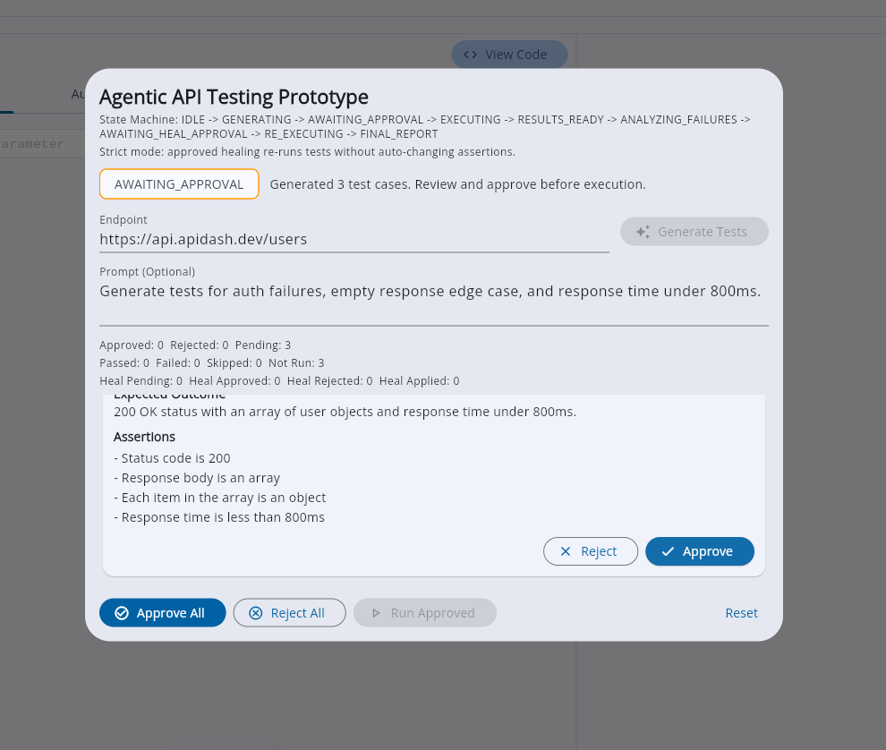

**3) Execution results with failure visibility**

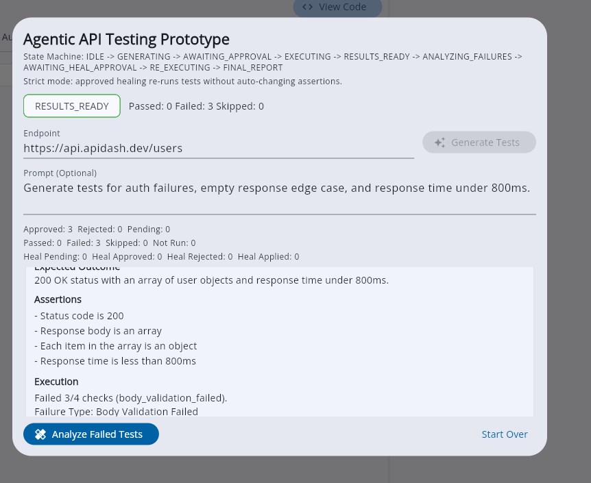

**4) Healing recommendations awaiting approval**

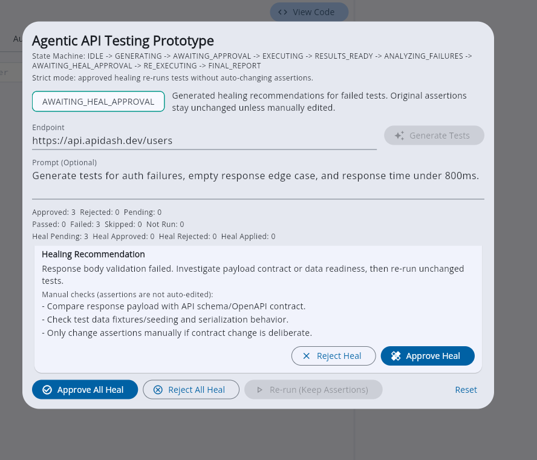

**5) FINAL_REPORT after `Approve All Heal + Re-run (Keep Assertions)`**

What this final screenshot demonstrates:

1. Workflow reaches `FINAL_REPORT` successfully.
2. Healing loop executed (`Heal Applied` > 0).
3. Failed checks remain visible when root cause is unresolved.
4. No silent assertion drift; user trust and reviewability are preserved.

---

**Total Hours:** 175 hours (within GSoC small project scope)

**Success Metrics for Evaluation:**
- ✅ Generate comprehensive test suites in <3 minutes per endpoint
- ✅ Achieve 95%+ test coverage across functional, edge case, and security categories
- ✅ Execute test suites with real-time monitoring and detailed logs
- ✅ Identify root causes for 90%+ of test failures
- ✅ Successfully heal tests after API changes with 85%+ accuracy
- ✅ Maintain 100% human control through mandatory approval checkpoints
- ✅ Support 3+ AI providers with automatic fallback
- ✅ Achieve <2 second latency for critical operations
- ✅ 80%+ code coverage with comprehensive test suite

---

### 5. Post-GSoC Vision and Long-Term Commitment

**This is not just a summer project—it's the foundation for API Dash's future as an intelligent testing platform.**

#### Immediate Post-GSoC (Months 1-3)
- **Community Support:** Active maintenance, bug fixes, and user support on Discord/GitHub
- **Feature Refinement:** Incorporate user feedback and iterate on UX
- **Documentation Enhancement:** Create video tutorials and advanced usage guides
- **Performance Optimization:** Continue profiling and optimizing based on real-world usage

#### Medium-Term Enhancements (Months 4-12)
- **Advanced Test Patterns:**
  - Contract testing for microservices
  - Load testing with performance assertions
  - Chaos engineering scenarios (network failures, timeouts, rate limits)
- **Team Collaboration Features:**
  - Shared test suites with version control
  - Test result sharing and comparison
  - Collaborative test review workflows
- **CI/CD Integration:**
  - GitHub Actions / GitLab CI integration
  - Automated test execution on API changes
  - Slack/Discord notifications for test failures

#### Long-Term Vision (Year 2+)
- **Test Intelligence:**
  - Historical failure pattern analysis
  - Predictive test failure detection
  - Smart test prioritization based on code changes
- **Ecosystem Expansion:**
  - Test marketplace for common API patterns
  - Community-contributed test templates
  - Plugin system for custom validators and healers
- **Enterprise Features:**
  - Team analytics and dashboards
  - Compliance testing (GDPR, HIPAA, SOC2)
  - Multi-environment test orchestration

**My Commitment:**
- Continue contributing to API Dash beyond GSoC
- Help onboard new contributors to the agentic testing feature
- Maintain and improve the feature based on community needs
- Participate in architectural discussions for future API Dash features

**Why I'll Stay Involved:**
1. **Personal Investment:** I've built agent-style systems before (Project Samarth) and am passionate about making AI tooling practical and trustworthy
2. **Career Alignment:** As a final-year student, contributing to high-visibility FOSS projects strengthens my profile for AI/ML engineering roles
3. **Community Value:** API Dash has an engaged, supportive community—I want to continue being part of that
4. **Technical Growth:** The intersection of AI, testing, and developer tools is where I want to specialize, and this project is perfect for that

This proposal is not about completing a GSoC project—it's about **building a lasting feature that transforms how developers test APIs**, with sustained commitment to make it exceptional.

---

## References

- Idea discussion: https://github.com/foss42/apidash/discussions/1230
- PR #1248 (docs: add Testing and Assertions guide with essential examples): https://github.com/foss42/apidash/pull/1248
- PR #1236 (closed: assertion framework exploration, then scope-aligned pivot): https://github.com/foss42/apidash/pull/1236
- PR #1223 (Add tests for APIDashAgentCaller #1221): https://github.com/foss42/apidash/pull/1223
- Resume: https://drive.google.com/file/d/12zJvrIma6cPOJ99OTc4Jiq7Fit1ld2_c/view?usp=sharing

### Technical References
- Issue #96: Unit testing / auto tests discussion
- Issue #100: Stress testing with multiple concurrent requests
- Model Context Protocol: https://modelcontextprotocol.io/
- OpenAPI Specification: https://swagger.io/specification/
- Human-in-the-Loop Patterns: https://developers.cloudflare.com/agents/guides/human-in-the-loop/
- MCP Architecture: https://www.emergentmind.com/topics/mcp-architecture-and-workflow
- Temporal HITL AI Agent: https://docs.temporal.io/ai-cookbook/human-in-the-loop-python
- MLflow Conversation Simulation: https://mlflow.org/docs/latest/genai/eval-monitor/running-evaluation/conversation-simulation/
- LangGraph Orchestration: https://docs.langchain.com/oss/python/langgraph/overview?_gl=1*79mbgi*_gcl_au*MTYzNDQyMjYyNi4xNzcwMjg2MzE5*_ga*MTY3OTk4OTU3Mi4xNzcwMjg2MzIx*_ga_47WX3HKKY2*czE3NzI0NjUwMDYkbzIkZzAkdDE3NzI0NjUwMDYkajYwJGwwJGgw
- AI-assisted Test Generation Research: https://arxiv.org/pdf/2409.00411
- GSOC 2025 Project: https://summerofcode.withgoogle.com/archive/2025/projects/1Yf6TmCm
