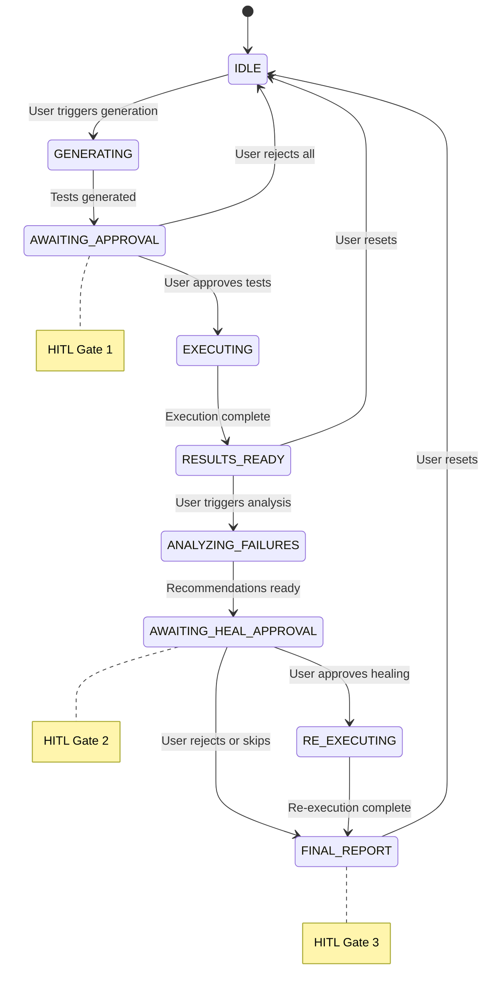
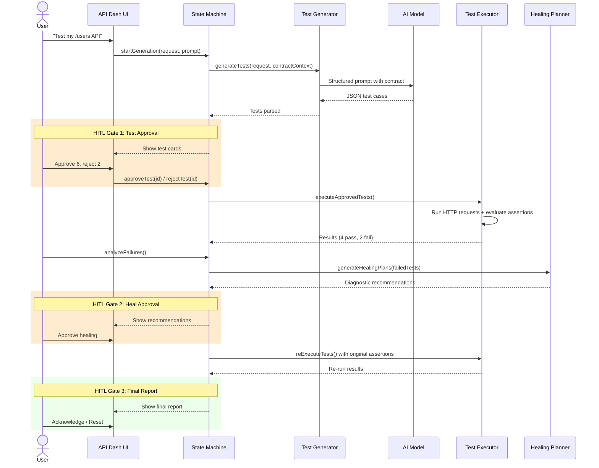
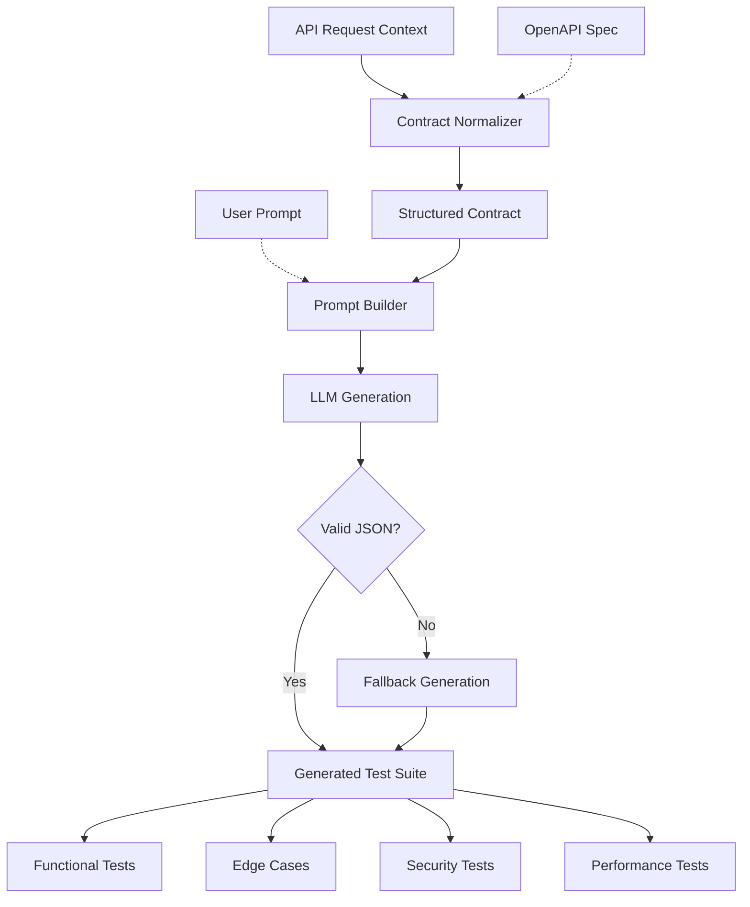
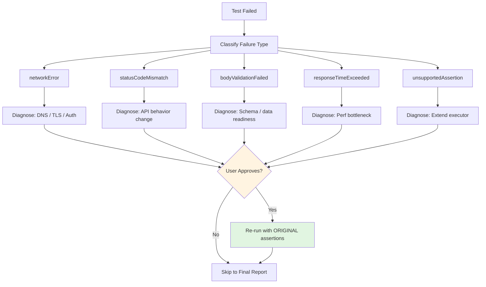
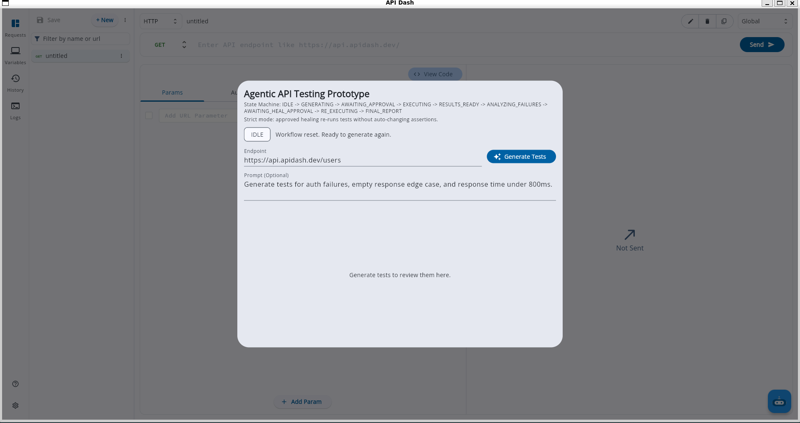
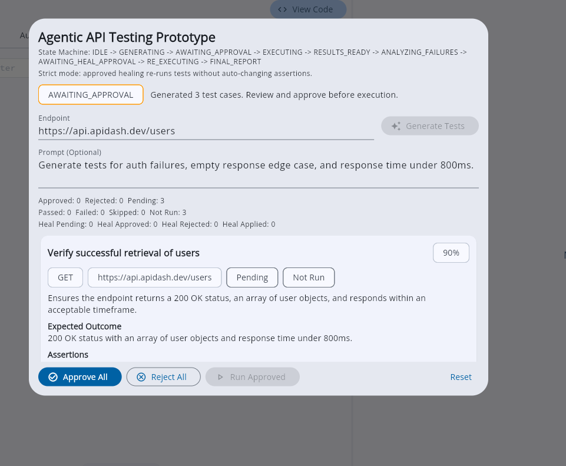
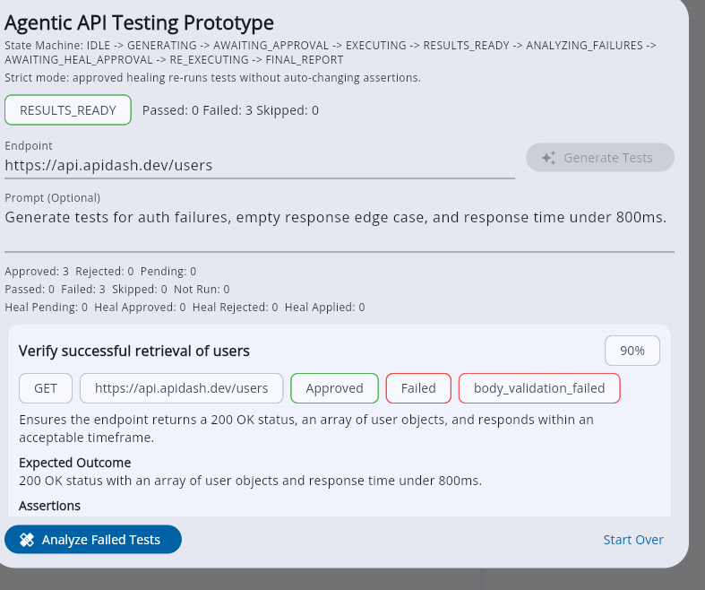
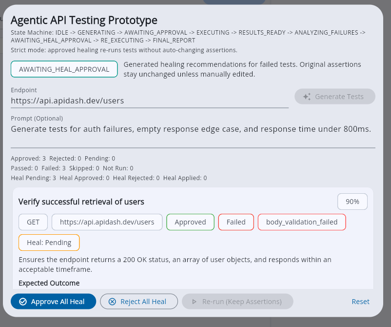
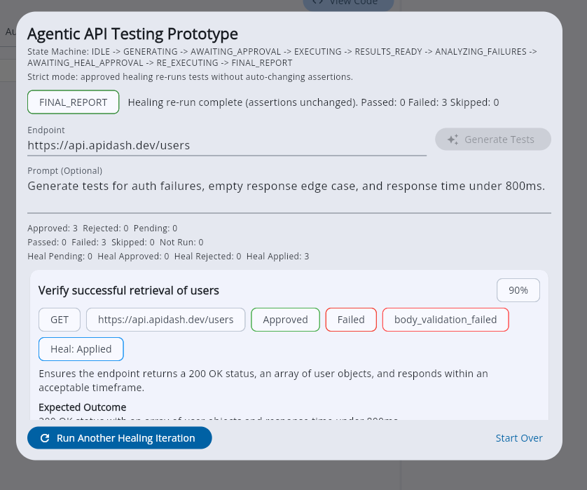

# GSoC 2026 Application: Agentic API Testing for API Dash

## Abstract

This proposal presents the design, prototype evidence, and execution plan for building an **agentic AI testing lifecycle** inside [API Dash](https://github.com/foss42/apidash). The system combines LLM-powered test generation with deterministic state-machine orchestration and human-in-the-loop approval gates to deliver a closed-loop workflow: **Generate → Review → Execute → Diagnose → Heal → Report**. A working prototype ([PR #1425](https://github.com/foss42/apidash/pull/1425/)) with 8 incremental commits already demonstrates the core architecture across all stages. The remaining GSoC work (~65-70% of the 175-hour budget) extends this foundation into contract-aware intelligence, multi-step workflow testing, assertion DSL expansion, and MCP Apps integration.

**Key differentiators:** deterministic state transitions with guarded approvals, strict healing that never silently mutates assertions, and contract-aware generation that uses API structure (not just raw text) to produce higher-quality tests.

### What is API Dash?

[API Dash](https://github.com/foss42/apidash) is an open-source, cross-platform API client built with **Flutter/Dart**. It supports REST, GraphQL, and gRPC requests, and includes an AI assistant called **DashBot** powered by configurable LLM providers. API Dash already has the building blocks (request models, response viewers, AI settings, Riverpod state management) that this project extends into a full testing lifecycle. This proposal adds the **agentic testing layer** — the missing piece that connects AI-powered test generation with deterministic execution, human review, and healing.

---

## 1. Candidate Profile

### 1.1 Personal Information

| Field | Value |
|---|---|
| Full Name | Aditya Suhane |
| Public Email | adityasuhane01@gmail.com |
| Discord (API Dash) | adityasuhane01 |
| GitHub | [adityasuhane-06](https://github.com/adityasuhane-06) |
| LinkedIn | [aditya-suhane-530103255](https://linkedin.com/in/aditya-suhane-530103255) |
| Timezone | IST (UTC+5:30) |
| Resume | [Public Resume Link](https://drive.google.com/file/d/12zJvrIma6cPOJ99OTc4Jiq7Fit1ld2_c/view?usp=sharing) |

### 1.2 University Information

| Field | Value |
|---|---|
| University | Gyan Ganga Institute of Technology and Sciences, Jabalpur |
| Program | B.Tech, Computer Science Engineering (Data Science) |
| Current Year | Final Year (4th Year) |
| Expected Graduation | June 2026 |

### 1.3 Availability and Commitments

I will be available to work **20-25 hours per week** during the GSoC period. My final-year coursework concludes in May 2026, and I have no competing internship or project commitments during the coding phase. I am fully committed to delivering on the 175-hour project scope within the 12-week timeline.

---

## 2. Motivation and Prior Open-Source Work

### 2.1 Why this problem

The problem I care most about is **trustworthy AI automation**: systems that reduce developer effort without reducing developer control.

Agentic API Testing belongs to exactly this category:

1. It needs AI for **breadth and speed** — generating dozens of test scenarios from a single endpoint is tedious manually but natural for LLMs.
2. It needs **deterministic execution and validation** — test outcomes must be reproducible, not probabilistic.
3. It needs **human approval checkpoints** — developers must remain in control of what gets executed and what changes get applied.
4. It must remain **maintainable as API contracts evolve** — self-healing must be safe, explicit, and approval-gated.

### 2.2 Relevant contribution history in API Dash

I have already contributed in areas directly related to this proposal:

| Contribution | What it demonstrates | Link |
|---|---|---|
| GSoC idea discussion and architecture feedback | Deep engagement with problem space and mentors | [Discussion #1230](https://github.com/foss42/apidash/discussions/1230#discussioncomment-15959507) |
| Testing/assertion documentation | Understanding of existing test infrastructure | [PR #1248](https://github.com/foss42/apidash/pull/1248) |
| Agent-call testing | Hands-on work with agentic service layer | [PR #1223](https://github.com/foss42/apidash/pull/1223) |
| Initial idea submission | Formal architecture proposal with hybrid design | [PR #1370](https://github.com/foss42/apidash/pull/1370) |
| **Prototype implementation (8 commits)** | **Full working agentic flow: generate → review → execute → heal → report** | [**PR #1425**](https://github.com/foss42/apidash/pull/1425/) |
| Prototype branch | Clean, review-ready codebase | [codex/agentic-testing-prototype-clean](https://github.com/adityasuhane-06/apidash/tree/codex/agentic-testing-prototype-clean) |

### 2.3 Relevant project experience

My strongest related project is **Project Samarth** (AI-powered agricultural Q&A):

1. GitHub: [Project-Samarth](https://github.com/adityasuhane-06/Project-Samarth)
2. Demo: [project-samarth-beta.vercel.app](https://project-samarth-beta.vercel.app/)

Key relevance to this proposal:

1. Agent-style orchestration with multiple fallback paths.
2. LLM reliability engineering under real usage constraints.
3. Production-focused debugging, iteration, and user feedback loops.

---

## 3. Project Definition

### 3.1 Problem Statement

API Dash has strong building blocks (DashBot, request models, scripting support), but testing remains fragmented across disconnected actions.

**Current pain points:**

1. **No closed lifecycle.** Test generation exists, but generation → execution → maintenance is not a unified workflow.
2. **Manual multi-step testing.** Workflow testing (e.g., register → login → profile → update → delete) requires manual state management across requests.
3. **API drift breaks tests silently.** Schema changes require manual test updates with no automated detection or recovery.
4. **AI suggestions lack governance.** Without approval gates and traceability, AI-generated tests cannot be trusted in production workflows.

### 3.2 Proposed Solution

Build an **agentic testing lifecycle** inside API Dash with explicit orchestration and human checkpoints:

```
Generate tests from request/spec context
        ↓
Human review and approval
        ↓
Execute approved tests with structured results
        ↓
Analyze failures and classify root causes
        ↓
Propose healing recommendations (diagnostic, not mutating)
        ↓
Human approval for healing actions
        ↓
Re-run healed tests and produce final report
```

**Core design principle:** AI assists, but humans stay in control of contract changes. Assertions are never silently mutated.

**Example conversational flow:**

```
User: "Generate tests for my /users API"
Agent: "I found a GET /users endpoint with query params (page, limit)
        and a POST /users endpoint requiring {name, email}.
        I'll generate 8 test cases covering:
        1. Valid user creation (201)
        2. Missing required field 'email' (400)
        3. Invalid email format (422)
        4. Duplicate user creation (409)
        5. GET with valid pagination (200)
        6. GET with page=-1 boundary (400)
        7. SQL injection in name field (400)
        8. Response time under 500ms
        
        [Approve All] [Review Individual] [Regenerate]"
User: clicks [Approve All]
Agent: "Running 8 tests... 6 passed, 2 failed.
        - Test 4 (Duplicate): Expected 409, got 500 → statusCodeMismatch
        - Test 8 (Latency): 650ms > 500ms threshold → responseTimeExceeded
        
        [Analyze Failures] [Reset]"
User: clicks [Analyze Failures]
Agent: "Recommendations:
        - Test 4: Server returns 500 instead of 409 for duplicates.
          This may indicate a missing unique constraint handler.
          Diagnose: Check DB constraint and error middleware.
        - Test 8: Response 650ms exceeds 500ms SLO.
          Diagnose: Investigate N+1 queries or missing pagination index.
          
        [Approve & Re-run] [Reject] [Skip to Report]"
```

### 3.3 Project Goals

**Primary goals:**

1. Create a deterministic state-machine-based testing workflow with guarded transitions.
2. Add high-quality LLM-powered generation that is spec/request/contract-aware.
3. Deliver actionable execution diagnostics with structured failure classification.
4. Introduce safe healing workflow with explicit user approval and immutable assertions.
5. Build maintainable architecture aligned with existing API Dash patterns (Riverpod + service layer).

### 3.4 Non-Goals for the first production slice

1. Full autonomous assertion rewriting without approval.
2. Complex graph branching / parallel orchestration in v1.
3. Heavy infrastructure dependencies for the initial rollout.
4. Load/stress testing (covered in separate GSoC idea).

---

## 4. Architecture and Workflow

### 4.1 Technical Design Principles

1. **Reuse before create.** Leverage existing API Dash primitives (DashBot, `RequestModel`, Riverpod providers, AI settings) before introducing new abstractions.
2. **Explicit orchestration.** Keep workflow control state-driven with guarded transitions — no implicit jumps.
3. **Separation of concerns.** Generation logic, execution logic, healing logic, and UI are isolated into distinct services.
4. **Actionable diagnostics.** Failure analysis must be understandable to developers, not opaque AI output.
5. **Safe healing.** Prefer approval-based, diagnostic-only healing over silent mutation. Assertions represent contracts and must not be auto-rewritten.

### 4.2 High-Level Architecture

```
┌─────────────────────────────────────────────────────────────────┐
│                    External AI Hosts                             │
│  ┌──────────┐  ┌──────────┐  ┌──────────┐  ┌──────────┐       │
│  │ Claude   │  │ VS Code  │  │  Cursor  │  │  Custom  │       │
│  │ Desktop  │  │ Copilot  │  │   IDE    │  │  Agents  │       │
│  └────┬─────┘  └────┬─────┘  └────┬─────┘  └────┬─────┘       │
│       └─────────────┴──────┬──────┴─────────────┘               │
│                            │ MCP Protocol                       │
└────────────────────────────┼────────────────────────────────────┘
                             │
┌────────────────────────────▼────────────────────────────────────┐
│                   API Dash MCP Server (Future)                   │
│  ┌─────────────────────────────────────────────────────────┐   │
│  │  MCP Tools: generate_tests | run_tests | heal_tests     │   │
│  │  MCP Apps: Config Panel | Results Dashboard | Approval  │   │
│  └─────────────────────────────────────────────────────────┘   │
└────────────────────────────┬────────────────────────────────────┘
                             │
┌────────────────────────────▼────────────────────────────────────┐
│              Agent Orchestration Layer (Implemented)              │
│       (LangGraph-style State Machine + HITL Checkpoints)         │
│  ┌──────────┐  ┌──────────┐  ┌──────────┐  ┌──────────┐       │
│  │Test Gen  │─▶│ Executor │─▶│Validator │─▶│ Healer   │       │
│  │  Agent   │  │  Agent   │  │  Agent   │  │  Agent   │       │
│  └──────────┘  └──────────┘  └──────────┘  └──────────┘       │
└─────────────────────────────────────────────────────────────────┘
```

### 4.3 Core Module Structure

The implementation is organized into focused modules following existing API Dash conventions:

```
lib/agentic_testing/
├── models/
│   ├── workflow_state.dart          # Workflow state enum (9 states)
│   ├── workflow_context.dart        # Orchestration context with counters
│   ├── test_case_model.dart         # Test case + healing decision models
│   └── contract_context.dart        # Contract metadata for generation
├── services/
│   ├── state_machine.dart           # Transition guards + orchestration
│   ├── test_generator.dart          # LLM prompt assembly + parsing
│   ├── test_executor.dart           # Request execution + assertion eval
│   ├── healing_planner.dart         # Diagnostic recommendation engine
│   ├── test_contract_normalizer.dart # Request → contract extraction
│   └── workflow_checkpoint_storage.dart # Persistence (SharedPreferences)
├── providers/
│   └── agentic_testing_providers.dart # Riverpod wiring
└── widgets/
    ├── test_generation_panel.dart    # Main panel with state-aware controls
    └── test_review_card.dart         # Per-test card with approve/reject
```

### 4.4 Core Data Models

The key Dart models that drive the orchestration (derived from `.kiro` design spec and implemented in PR #1425):

```dart
// Workflow state enum — 9 deterministic states
enum AgenticWorkflowState {
  idle,
  generating,
  awaitingApproval,      // 🔒 HITL Gate 1
  executing,
  resultsReady,
  analyzingFailures,
  awaitingHealApproval,  // 🔒 HITL Gate 2
  reExecuting,
  finalReport,           // 🔒 HITL Gate 3
}

// Test case with healing metadata
class AgenticTestCase {
  final String id;
  final String name;
  final String description;
  final List<String> assertions;
  AgenticTestStatus status;       // passed | failed | skipped | notRun
  FailureType? failureType;      // network | statusCode | body | time | unsupported
  TestHealingDecision healingDecision; // none | pending | approved | rejected | applied
  String? healingSuggestion;     // Diagnostic recommendation (never mutates assertions)
}

// Contract context for generation quality
class AgenticContractContext {
  final String method;
  final String endpointPath;
  final List<String> pathParameters;
  final List<String> queryParameters;
  final List<String> headerParameters;
  final List<String> requestJsonFields;
  final List<String> responseJsonFields;
  final String? authRequirement;
  
  String toPromptSection(); // Formats for LLM context enrichment
}
```

### 4.5 Workflow State Machine

The lifecycle is governed by a deterministic state machine with **9 states** and **3 mandatory human-approval gates**:



Each transition is **guarded at the service layer** — invalid transitions are blocked before reaching UI, ensuring predictable behavior even under unexpected conditions.

### 4.5 Human-in-the-Loop Control Points

| Gate | When | User Actions | Why |
|---|---|---|---|
| **Gate 1: Test Approval** | After generation, before execution | Approve/reject per test or in bulk | Prevents executing unwanted or incorrect test scenarios |
| **Gate 2: Heal Approval** | After failure analysis, before re-run | Approve/reject healing per test | Prevents silent contract mutation; keeps assertions immutable |
| **Gate 3: Final Review** | After re-execution | Review outcomes, reset workflow | Ensures developer sees and acknowledges final results |

### 4.7 Human-in-the-Loop Sequence



### 4.8 Why this architecture is practical

1. **Matches API Dash patterns.** Riverpod `StateNotifier` + service/model/widget separation used throughout existing codebase.
2. **Easy to test.** Each module has isolated responsibility with injectable dependencies (e.g., executor accepts injected request function for unit testing).
3. **Review-friendly.** Incremental milestones map to independent PRs with clear scope boundaries.
4. **Future-proof.** Supports MCP Apps integration without rewriting core orchestration logic.

---

## 5. Implemented Work Evidence (Prototype + Contributions)

### 5.1 PR #1425 — Complete Commit History

All 8 commits were authored on March 23-24, 2026 as incremental vertical slices, each adding one complete layer of functionality:

| # | Commit | Message | Files | What This Increment Added | Changes Link |
|---|---|---|---:|---|---|
| 1 | `9ef6835` | feat: add agentic testing prototype (state machine + llm generation + review ui) | 9 | Initial state machine (`IDLE→GENERATING→AWAITING_APPROVAL`), LLM-based generation with structured JSON parsing and fallback handling, review UI with approve/reject per card + bulk controls, Riverpod wiring, DashBot integration entry points | [View](https://github.com/foss42/apidash/pull/1425/changes/9ef6835aebced61d593d7992a874c6d9195dad9a) |
| 2 | `ae5c2c9` | feat: add phase-2 execution flow for agentic test prototype | 5 | `EXECUTING→RESULTS_READY` transitions, `test_executor.dart` running approved tests via existing request flow, per-test pass/fail/skipped results in UI, focused `state_machine_test.dart` | [View](https://github.com/foss42/apidash/pull/1425/changes/ae5c2c9c0fe88645b8a677b3bd1270bab33b943e) |
| 3 | `31baf64` | feat: add workflow checkpoint persistence for agentic prototype | 4 | `workflow_checkpoint_storage.dart` (SharedPreferences-backed), `toJson`/`fromJson` in context, `hydrateFromCheckpoint()` for workflow resume on panel reload | [View](https://github.com/foss42/apidash/pull/1425/changes/31baf647f7aef1e038d59b117c0118e566390847) |
| 4 | `d08e260` | feat: support custom prompt input for agentic test generation | 3 | Optional user prompt field in UI, prompt passed through state machine → generator → LLM request, persisted in checkpoint state for session continuity | [View](https://github.com/foss42/apidash/pull/1425/changes/d08e26002ba70756b96d5203a167ce7e9a828026) |
| 5 | `80d1f26` | feat: add failure classification and stronger assertion validation | 4 | `FailureType` enum (`network_error`, `status_code_mismatch`, `body_validation_failed`, `response_time_exceeded`, `unsupported_assertion`), injectable executor via strategy pattern, strengthened assertions (2xx/exact codes, body structure, array length, response-time), `test_executor_test.dart` | [View](https://github.com/foss42/apidash/pull/1425/changes/80d1f26cf2586de0bc236f895c476cb5676d5854) |
| 6 | `874df49` | feat: add self-healing loop with approval and re-execution | 10 | `TestHealingDecision` enum, `healing_planner.dart` service generating repair suggestions by failure type, 4 new workflow states (`analyzingFailures`, `awaitingHealApproval`, `reExecuting`, `finalReport`), HITL approve/reject in healing cards, healing counter getters (`healPending`, `healApproved`, `healRejected`, `healApplied`) | [View](https://github.com/foss42/apidash/pull/1425/changes/874df49f91e619cb4fe5b4a709720abee34686f9) |
| 7 | `7cbbbae` | refactor(agentic-testing): enforce strict healing without assertion mutation | 4 | **Critical safety refactor:** replaced auto-mutation with diagnostic-only recommendations, assertions become immutable during healing, re-execution uses original expectations, regression test ensuring assertion contracts are preserved | [View](https://github.com/foss42/apidash/pull/1425/changes/7cbbbae829c96ce9f4f3c5a84bbcb29b77fadcdd) |
| 8 | `d7f2d50` | feat(agentic-testing): add contract-aware generation foundation (PR-A1) | 11 | `AgenticContractContext` model with method/path/params/schema fields, `AgenticTestContractNormalizer` extracting contracts from `HttpRequestModel`/`HttpResponseModel`, OpenAPI-aware path inference (e.g., `/users/123` → `/users/{userId}`), `toPromptSection()` for LLM context enrichment, normalizer + generator-context unit tests | [View](https://github.com/foss42/apidash/pull/1425/changes/d7f2d50107adc04f82f24667f610c0e92e8b8e1a) |

### 5.2 Detailed Implementation by Section

#### Section A: State Machine Orchestrator

**Why this matters:** Without deterministic orchestration, the testing workflow becomes a fragile sequence of ad-hoc actions that break under edge cases. A state machine guarantees that only valid transitions occur, making the system predictable for both users and maintainers.

**What was implemented:**

1. Defined a deterministic workflow enum covering generation, review, execution, analysis, healing, and final reporting states.
2. Added transition guards so illegal transitions are blocked at service layer rather than UI layer.
3. Centralized status messaging and counters in workflow context for predictable UI rendering.
4. Added explicit action handlers for approve/reject operations at both generation and healing checkpoints.

**How it works:**

- The `AgenticTestingStateMachine` (`StateNotifier`) owns the workflow context and enforces a transition map.
- Each state change validates the current state against allowed transitions before proceeding.
- The guard clause pattern prevents UI-level bugs from causing invalid states.

**Key files:** `workflow_state.dart`, `workflow_context.dart`, `state_machine.dart`, `agentic_testing_providers.dart`

**PR evidence:**
[PR #1425](https://github.com/foss42/apidash/pull/1425/) |
[Initial orchestrator](https://github.com/foss42/apidash/pull/1425/changes/9ef6835aebced61d593d7992a874c6d9195dad9a) |
[Execution-state extension](https://github.com/foss42/apidash/pull/1425/changes/ae5c2c9c0fe88645b8a677b3bd1270bab33b943e) |
[Healing-state extension](https://github.com/foss42/apidash/pull/1425/changes/874df49f91e619cb4fe5b4a709720abee34686f9)

---

#### Section B: LLM Test Generator

**Why this matters:** Manual test creation is tedious and coverage-limited. LLM-powered generation produces diverse scenarios (happy path, edge cases, security vectors) in seconds, but requires structured parsing and contract awareness to be reliable.

**What was implemented:**

1. Request-context-aware prompt assembly (endpoint/method/body/header hints).
2. Optional user prompt input for scenario steering (e.g., "test auth failures", "focus on latency").
3. Structured output parsing with fallback generation for malformed/empty LLM responses.
4. Contract normalization to improve consistency before sending generation context.

**How it works:**

- The generator constructs a multi-section prompt: system instructions, endpoint details, contract context (if available), and optional user guidance.
- LLM response is parsed as structured JSON; if parsing fails, a fallback path generates a safe default test set.
- The `AgenticContractContext.toPromptSection()` method formats extracted API contract data (parameters, schemas, auth requirements) into a prompt section that instructs the AI to prioritize structural rules over simple pattern matching.

**Test generation strategy:**



**Key files:** `test_generator.dart`, `contract_context.dart`, `test_contract_normalizer.dart`, `test_case_model.dart`

**PR evidence:**
[Generation baseline](https://github.com/foss42/apidash/pull/1425/changes/9ef6835aebced61d593d7992a874c6d9195dad9a) |
[Prompt support](https://github.com/foss42/apidash/pull/1425/changes/d08e26002ba70756b96d5203a167ce7e9a828026) |
[Contract-aware generation](https://github.com/foss42/apidash/pull/1425/changes/d7f2d50107adc04f82f24667f610c0e92e8b8e1a)

---

#### Section C: Human-in-the-Loop Review UI

**Why this matters:** Trust is the critical bottleneck for AI-assisted testing. Without explicit review controls, developers cannot verify that generated tests match their intent before execution begins.

**What was implemented:**

1. Test cards with per-test approve/reject actions and confidence display.
2. Approve-all / reject-all batch controls for faster triage.
3. Stage-based UI gating so controls are visible only in valid workflow states.
4. Integrated the panel into DashBot without replacing existing request execution UI.

**How it works:**

- The `TestGenerationPanel` widget watches the state machine and conditionally renders controls based on current workflow state.
- Each `TestReviewCard` displays test name, description, assertions, and approval controls.
- The panel uses color-coded state indicators: blue for generation, amber for approval, green for execution, teal for healing, purple for analysis.

**Key files:** `test_generation_panel.dart`, `test_review_card.dart`, `dashbot_home_page.dart`, `dashbot_default_page.dart`

**PR evidence:** [Initial review UX](https://github.com/foss42/apidash/pull/1425/changes/9ef6835aebced61d593d7992a874c6d9195dad9a)

---

#### Section D: Execution + Result Diagnostics

**Why this matters:** The bridge between "AI suggested something" and "it actually works" is execution with structured, actionable diagnostics. Without failure classification, developers cannot efficiently debug what went wrong.

**What was implemented:**

1. Execution path that runs only approved tests, skipping rejected or non-reviewed tests.
2. Per-test status tracking (`passed`, `failed`, `skipped`, `notRun`) with aggregate counters.
3. Assertion-level reporting with failure reasons displayed in the UI.
4. Failure classification engine with typed categories: `networkError`, `statusCodeMismatch`, `bodyValidationFailed`, `responseTimeExceeded`, `unsupportedAssertion`.
5. Injectable request function for unit testability (strategy pattern).

**How it works:**

- The executor maps natural-language assertions to runtime checks: status code validation (exact, range, 2xx), body checks (empty/not-empty, JSON structure, object, array), array length constraints, response-time thresholds.
- Each assertion is individually evaluated and classified, producing a per-test failure evidence bundle.
- The request function is injected via constructor, enabling unit tests to mock HTTP behavior without network calls.

**Key files:** `test_executor.dart`, `test_case_model.dart`

**PR evidence:**
[Execution integration](https://github.com/foss42/apidash/pull/1425/changes/ae5c2c9c0fe88645b8a677b3bd1270bab33b943e) |
[Failure classification](https://github.com/foss42/apidash/pull/1425/changes/80d1f26cf2586de0bc236f895c476cb5676d5854)

---

#### Section E: Healing Recommendations + Safe Re-run

**Why this matters:** When tests fail due to API drift, developers need actionable guidance — not silent auto-fixes. The critical design decision here is that **assertions represent contracts and must never be auto-mutated**. Healing means diagnosing the problem and re-verifying after the developer fixes it.

**What was implemented:**

1. Analyzer stage for failed tests producing typed healing recommendations.
2. Explicit heal approval/rejection flow before re-execution.
3. Re-execution stage with original (immutable) assertions.
4. **Strict mode enforcement (commit `7cbbbae`):** replaced auto-mutation logic with diagnostic-only recommendations:
   - `networkError` → verify reachability, DNS, TLS, auth headers
   - `statusCodeMismatch` → treat observed status as diagnostic signal, not new contract
   - `bodyValidationFailed` → investigate payload contract or data readiness against API schema
   - `responseTimeExceeded` → investigate performance bottleneck, do not auto-relax SLO
   - `unsupportedAssertion` → add executor support for assertion syntax, do not rewrite test
5. Healing counters (`healPending`, `healApproved`, `healRejected`, `healApplied`) tracked in context.

**How it works:**

- The `AgenticTestHealingPlanner` generates failure-type-specific diagnostic strings.
- "Approve Heal" triggers re-execution with original assertions — the user is expected to fix the environment/API, then verify the fix.
- A regression test (`re-executes approved healed tests without mutating assertions`) ensures immutability is preserved.

**Strict healing decision flow:**



> **Key insight:** Unlike traditional self-healing where the system adjusts test expectations to match broken behavior, strict healing preserves test contracts. The AI diagnoses *why* the test failed and advises the developer on what to fix in the API/environment — then re-runs with the original assertions to verify the fix.

**Key files:** `healing_planner.dart`, `state_machine.dart`, `test_generation_panel.dart`

**PR evidence:**
[Healing workflow stages](https://github.com/foss42/apidash/pull/1425/changes/874df49f91e619cb4fe5b4a709720abee34686f9) |
[Strict safety guardrails](https://github.com/foss42/apidash/pull/1425/changes/7cbbbae829c96ce9f4f3c5a84bbcb29b77fadcdd)

---

#### Section F: Contract-Aware Generation + Persistence + Tests

**Why this matters:** Generating tests from raw endpoint text alone misses structural constraints that an API contract provides. Contract awareness dramatically improves test relevance and coverage. Persistence prevents workflow progress loss during long sessions.

**What was implemented:**

1. `AgenticContractContext` model with structured fields: `method`, `endpointPath`, `pathParameters`, `queryParameters`, `headerParameters`, `requestJsonFields`, `responseJsonFields`, `authRequirement`.
2. `AgenticTestContractNormalizer` extracting contract context from `HttpRequestModel`, `HttpResponseModel`, and OpenAPI metadata.
3. OpenAPI-aware path inference (e.g., `/users/123` → `/users/{userId}`).
4. `toPromptSection()` method formatting contract data for LLM context enrichment.
5. Checkpoint storage with `SharedPreferences` for workflow state persistence and resume.
6. Focused unit tests for state transitions, executor behavior, contract normalizer, and generator context.

**Key files:** `contract_context.dart`, `test_contract_normalizer.dart`, `workflow_checkpoint_storage.dart`, `state_machine_test.dart`, `test_executor_test.dart`, `test_contract_normalizer_test.dart`, `test_generator_contract_context_test.dart`

**PR evidence:**
[Contract-aware generation](https://github.com/foss42/apidash/pull/1425/changes/d7f2d50107adc04f82f24667f610c0e92e8b8e1a) |
[Checkpoint persistence](https://github.com/foss42/apidash/pull/1425/changes/31baf647f7aef1e038d59b117c0118e566390847) |
[Strict healing + coverage tests](https://github.com/foss42/apidash/pull/1425/changes/7cbbbae829c96ce9f4f3c5a84bbcb29b77fadcdd)

### 5.3 Screenshot Evidence

| Stage | Linked Evidence | Preview |
|---|---|---|
| IDLE (Contract-Aware Ready State) | [01_idle_contract_aware.png](images/01_idle_contract_aware.png) |  |
| AWAITING_APPROVAL (Generated Test Cards) | [02_awaiting_approval_generated_1.png](images/02_awaiting_approval_generated_1.png) |  |
| EXECUTING / RESULTS_READY | [03_executing_or_results_ready_1.png](images/03_executing_or_results_ready_1.png) |  |
| HEALING RECOMMENDATIONS | [04_healing_recommendations_1.png](images/04_healing_recommendations_1.png) |  |
| FINAL REPORT (Re-run Keep Assertions) | [05_rerun_keep_assertions.png](images/05_rerun_keep_assertions.png) |  |

Additional stage variants used for evidence completeness:

1. [02_awaiting_approval_generated_2.png](images/02_awaiting_approval_generated_2.png)
2. [02_awaiting_approval_generated_3.png](images/02_awaiting_approval_generated_3.png)
3. [02_awaiting_approval_generated_4.png](images/02_awaiting_approval_generated_4.png)
4. [03_executing_or_results_ready_2.png](images/03_executing_or_results_ready_2.png)
5. [03_executing_or_results_ready_3.png](images/03_executing_or_results_ready_3.png)
6. [03_executing_or_results_ready_4.png](images/03_executing_or_results_ready_4.png)
7. [04_healing_recommendations_2.png](images/04_healing_recommendations_2.png)

---

## 6. Planned GSoC Implementation Scope

The prototype covers ~30-35% of the full GSoC scope. The remaining work extends the foundation into production-grade capabilities:

### 6.1 What the prototype already proves

The prototype ([PR #1425](https://github.com/foss42/apidash/pull/1425/)) is not a mockup — it is a working, runnable implementation that proves the following:

| Question a Mentor Might Ask | What the Prototype Proves | Evidence |
|---|---|---|
| "Can you actually build a state machine in Dart/Flutter?" | Yes — 9-state deterministic state machine with guarded transitions, unit tested | Commits `9ef6835`, `ae5c2c9`, `874df49` |
| "Can LLM output be reliably parsed into structured tests?" | Yes — structured JSON parsing with fallback for malformed output | Commit `9ef6835` |
| "Does the HITL review flow actually work in the UI?" | Yes — approve/reject per card + bulk controls, stage-gated rendering | Commits `9ef6835`, `874df49` + 12 screenshots |
| "Can generated tests actually be executed against real APIs?" | Yes — executor runs approved tests, evaluates assertions, shows pass/fail | Commit `ae5c2c9` |
| "How do you classify failures for debugging?" | Implemented — 5-type classification with typed `FailureType` enum | Commit `80d1f26` + executor unit tests |
| "Will healing silently break test contracts?" | No — strict mode enforces immutable assertions during healing | Commit `7cbbbae` + regression test |
| "Can you integrate contract/schema context into generation?" | Yes — `AgenticContractContext` + `AgenticTestContractNormalizer` + OpenAPI path inference | Commit `d7f2d50` + normalizer/generator tests |
| "Does workflow state survive app restarts?" | Yes — SharedPreferences checkpoint persistence + hydration | Commit `31baf64` |

### 6.2 What remains to be built (GSoC scope)

| Milestone | Deliverable Features | How I Will Implement It | Est. Hours |
|---|---|---|---:|
| **A: Contract Intelligence** | Full OpenAPI/Swagger 3.0 parser, schema-level constraint extraction (required fields, types, enums), operation-level normalization | Build a Dart OpenAPI parser that extracts `paths`, `schemas`, `parameters` into `AgenticContractContext`. Extend existing `test_contract_normalizer.dart` to handle full spec ingestion. Add unit tests for each schema type. | ~18h |
| **B: Multi-Step Workflow Testing** | Workflow step model, inter-step data extraction (IDs, tokens, cookies), sequential executor with `{{variable}}` template resolution, per-step execution trace | Create `WorkflowStep` model linking ordered `TestCase` instances. Add response-value extractor using JSON-path expressions. Build sequential executor that resolves `{{step1.response.id}}` variables before each request. | ~22h |
| **C: Assertion DSL Expansion** | Structured assertion types (status/header/body/jsonpath/latency), JSON-path body assertions (`$.users[0].email == "x"`), unsupported-assertion diagnostics | Define `Assertion` class hierarchy (StatusAssertion, HeaderAssertion, BodyPathAssertion, LatencyAssertion). Replace heuristic string matching with typed evaluation. Add JSON-path library integration. | ~18h |
| **D: Advanced Healing Analytics** | Failure evidence bundles with request/response snapshots, confidence scoring per recommendation, max-iteration policy (prevent infinite heal loops), terminal "manual fix required" status | Extend `HealingPlanner` with confidence model (0.0-1.0) based on failure pattern match quality. Add iteration counter to workflow context. Surface evidence bundles (expected vs actual) in healing cards. | ~18h |
| **E: Coverage Feedback Loop** | Coverage dimension tracking (auth, invalid input, boundary, error, latency), gap detection, next-cycle generation input | Build `CoverageTracker` that tags each test case with coverage dimensions. After execution, identify which dimensions have zero coverage. Feed gaps as structured hints into next generation cycle. | ~16h |
| **F: MCP Apps Integration** | Transport-agnostic adapter layer, MCP tool handlers (generate/execute/report/heal), rich MCP App UI panels for test review and results | Build adapter interface (`AgenticTestingMCPAdapter`) between core services and MCP protocol. Implement MCP tool handlers that delegate to existing state machine. Create HTML/JS MCP App panels for review/results. | ~20-24h |

### 6.3 Numbered Feature Deliverables (for evaluation)

This is the concrete list of features I commit to delivering during GSoC:

| # | Feature | Definition of Done | POC Status |
|---:|---|---|---|
| 1 | **Deterministic workflow state machine** | All 9 states with guarded transitions, unit tested | ✅ Proven in prototype |
| 2 | **LLM test generation with contract awareness** | Generate 5+ tests per endpoint using API structure, not just text | ✅ Proven (basic), GSoC extends |
| 3 | **Human-in-the-loop test approval UI** | Per-test approve/reject + bulk controls in DashBot panel | ✅ Proven in prototype |
| 4 | **Test execution engine with failure classification** | Execute approved tests, classify failures into 5+ typed categories | ✅ Proven in prototype |
| 5 | **Strict healing with diagnostic recommendations** | Healing never mutates assertions, provides actionable diagnostics | ✅ Proven in prototype |
| 6 | **Full OpenAPI/Swagger spec parsing** | Parse 3.0 specs, extract schemas, parameters, auth requirements | 🔲 Planned (GSoC Week 4) |
| 7 | **Multi-step workflow testing** | Chain requests with variable extraction (IDs, tokens) across steps | 🔲 Planned (GSoC Week 5-6) |
| 8 | **Structured assertion DSL** | JSON-path assertions, typed evaluation, header/status/body/latency | 🔲 Planned (GSoC Week 5) |
| 9 | **Healing with confidence scoring** | Rated recommendations with max-iteration safety policy | 🔲 Planned (GSoC Week 7-8) |
| 10 | **MCP Apps adapter + test review panel** | Testing workflow accessible from Claude Desktop / VS Code via MCP | 🔲 Planned (GSoC Week 9-10) |

> **For the mentor:** Features 1-5 are already implemented and runnable in PR #1425. Features 6-10 are the planned GSoC scope with clear implementation approaches above.

---

## 7. Delivery Timeline (Table-Based)

Total planned effort: **175 hours** across 12 weeks.

### 7.1 Community Bonding Period (Pre-Week 1)

| Activity | Outcome |
|---|---|
| Finalize architecture decisions with mentors | Validated state contracts and transition rules |
| Review mentor feedback on PR #1425 | Identified priority adjustments |
| Set up CI integration for prototype branch | Baseline for incremental quality checks |

### 7.2 Phase 1: Core Engine (Weeks 1-6, Midterm Evaluation)

| Week | Hours | Focus Area | Implementation Target | Planned Evidence (PR/Artifact) |
|---|---:|---|---|---|
| 1 | 16 | Architecture freeze | Finalize state contracts, data models, transition guard rules | Architecture doc update + state-diagram commit |
| 2 | 16 | Orchestrator hardening | Complete deterministic transition checks and action gating | Unit tests for valid/invalid transitions |
| 3 | 18 | Generation quality | Improve prompt templates, parsing robustness, fallback behavior | PR with generator refinements + test snapshots |
| 4 | 16 | Contract-aware generation | OpenAPI/request-context ingestion and normalizer improvements | PR with contract-context enhancements |
| 5 | 18 | Execution depth | Expand assertion semantics and execution telemetry | PR with executor updates + result schema screenshots |
| 6 | 16 | Validation reporting | Add richer failure categories and actionable diagnostics | PR with failure-reporting improvements |

**Midterm deliverables:** robust orchestrator, contract-aware generation, comprehensive execution with failure classification.

### 7.3 Phase 2: Advanced Features + MCP (Weeks 7-12, Final Evaluation)

| Week | Hours | Focus Area | Implementation Target | Planned Evidence (PR/Artifact) |
|---|---:|---|---|---|
| 7 | 18 | Healing intelligence | Improve recommendation rationale/confidence and mapping logic | PR with healing planner improvements |
| 8 | 16 | Healing governance | Tighten approval UX, strict-mode controls, rerun guardrails | PR with approval safety enhancements |
| 9 | 18 | MCP Apps integration | Build adapter layer for generate/execute/report/heal operations | Design doc + first MCP-facing prototype |
| 10 | 17 | Hardening + docs | Integration tests, refactors, and technical documentation | Quality PR + docs PR |
| 11 | 13 | Mentor feedback window | Incorporate review comments and prioritize requested changes | Follow-up patch PRs based on mentor feedback |
| 12 | 13 | Final stabilization | Final demo flow polish, release notes, handoff package | Final report + demo assets |

**Final deliverables:** complete agentic testing lifecycle, MCP adapter layer, full documentation, demo-ready stability.

### 7.4 Milestone Gates

| Milestone | Definition of Done | Evidence Expected |
|---|---|---|
| M1: Orchestration Core | Deterministic state transitions with guardrails | State-machine tests, transition logs |
| M2: Generation + Review | High-quality generated tests with approval UX | UI screenshots, generation tests |
| M3: Execution + Validation | Reliable execution with actionable failure insights | Executor tests, failure classification output |
| M4: Healing Workflow | Approval-based healing and re-execution loop | Healing stage screenshots, loop tests |
| M5: MCP Apps Track | Initial MCP-compatible adapter and UI interaction flow | Architecture notes, integration demo clip |
| M6: Production Readiness | Stability, docs, and measurable quality metrics | Coverage report, docs, final demo |

---

## 8. MCP Apps Leverage Plan

### 8.1 Why MCP Apps are relevant here

MCP Apps provide a practical way to expose rich testing workflows directly inside AI-host experiences instead of reducing everything to plain chat text.

| Feature | Without MCP Apps | With MCP Apps |
|---------|------------------|---------------|
| Test approval | Text-only in chat | Interactive checklist UI |
| Results review | JSON dump | Visual dashboard with charts |
| Self-healing | Accept/reject text | Side-by-side diff viewer |
| Configuration | Manual prompting | Form-based config panel |

Target value:

1. Interactive test review panels in host context.
2. Visual execution and failure reporting.
3. Healing approval panels with clear recommendation context.

### 8.2 Planned implementation track

| Phase | Scope | Outcome |
|---|---|---|
| MCP-A | Define transport-agnostic adapter interfaces between agentic testing core and MCP surface | Keeps core logic independent from host protocol details |
| MCP-B | Expose essential operations (generate, execute, report, recommend healing) through adapter | Minimal useful host integration path |
| MCP-C | Add first rich UI surfaces for review and results | Improves trust and usability in host environments |
| MCP-D | Validate host compatibility and fallback behavior | Stable baseline for expansion after GSoC |

### 8.3 Dependency note

MCP Apps integration is planned as **additive and modular**. Core testing workflow does not block on full MCP rollout, ensuring the main value can ship reliably within the GSoC window.

---

## 9. Risk Matrix and Mitigation

| Risk | Impact | Likelihood | Mitigation |
|---|---|---|---|
| Scope expansion beyond 175 hours | High | Medium | Strict milestone gates and PR slicing |
| LLM output inconsistency | High | Medium | Structured parsing, fallback tests, approval checkpoints |
| Healing recommendations produce unsafe changes | High | Medium | Strict no-silent-mutation policy + explicit approval (already implemented) |
| Provider quotas/rate limits | Medium | Medium | Retry policy, fallback provider strategy, caching |
| Workflow complexity harms maintainability | Medium | Medium | Service isolation + tests per module |
| Late-stage integration regressions | Medium | Low | Continuous integration tests and milestone hardening |
| MCP dependency uncertainty | Medium | Medium | Transport-agnostic adapters; demo with mock host if needed |

---

## 10. Success Metrics

### 10.1 Product Metrics

1. Reduce manual test creation effort significantly through guided generation.
2. Improve failure diagnosis clarity with structured execution reports.
3. Preserve explicit developer control for critical test modifications.
4. Improve resilience to API drift through approval-based healing workflows.

### 10.2 Engineering Metrics

1. Reliable state transition behavior under tested scenarios.
2. Strong automated coverage for state machine and executor logic.
3. Low regression rate across incremental PR deliveries.
4. Clear documentation for maintainers and future contributors.

---

## 11. Communication and Review Cadence

Planned mentor collaboration model:

1. **Weekly progress summary** with completed work, blockers, and next steps.
2. **Incremental PRs** with explicit scope and test evidence.
3. **Early architecture validation** before deeper implementation branches.
4. **Feedback-first iteration** instead of large, late, hard-to-review drops.

---

## 12. Why This Proposal is Executable

1. **The architecture is incremental and already prototyped in core slices.** 8 commits demonstrate working generation, review, execution, healing, and contract awareness.
2. **Significant implementation evidence exists today** (not only design intent). PR #1425 with 8 commit-level diffs provides line-by-line proof of approach viability.
3. **The plan is milestone-driven, measurable, and reviewable.** Each milestone has clear definition-of-done criteria and expected evidence.
4. **Risk controls are explicitly integrated into delivery strategy.** Strict healing mode, transition guards, and approval gates are already implemented in the prototype.
5. **The remaining scope is well-defined.** The execution plan breaks remaining work into 6 concrete milestones with PR-level granularity.

---

## 13. References

### 13.1 Project and Contribution References

1. Idea Discussion: [Discussion #1230](https://github.com/foss42/apidash/discussions/1230#discussioncomment-15959507)
2. Initial Idea Submission: [PR #1370](https://github.com/foss42/apidash/pull/1370)
3. Testing/Assertions Guide: [PR #1248](https://github.com/foss42/apidash/pull/1248)
4. Agent Caller Tests: [PR #1223](https://github.com/foss42/apidash/pull/1223)
5. Prototype PR: [PR #1425](https://github.com/foss42/apidash/pull/1425/)
6. Prototype Branch: [codex/agentic-testing-prototype-clean](https://github.com/adityasuhane-06/apidash/tree/codex/agentic-testing-prototype-clean)

### 13.2 Technical References

1. MCP Specification: [modelcontextprotocol.io](https://modelcontextprotocol.io/)
2. MCP Apps Guide: [A Practical Guide to Building MCP Apps](https://dev.to/ashita/a-practical-guide-to-building-mcp-apps-1bfm)
3. OpenAPI Specification: [swagger.io/specification](https://swagger.io/specification/)
4. Human-in-the-Loop Patterns: [Cloudflare Agents HITL Guide](https://developers.cloudflare.com/agents/guides/human-in-the-loop/)
5. LangGraph Concepts: [LangGraph Overview](https://docs.langchain.com/oss/python/langgraph/overview)
