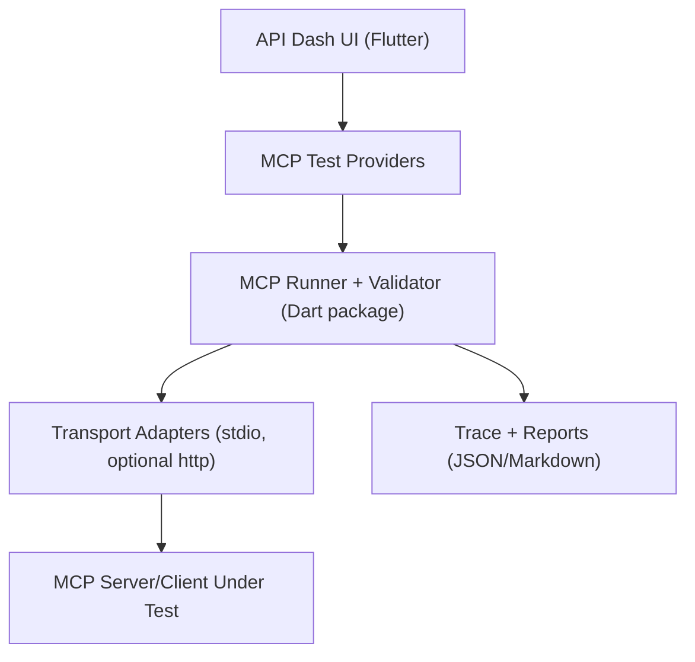

# GSoC 2026 Application - Ayush Kumar Singh - MCP Testing

### About
1. Full Name: Ayush Kumar Singh
2. Contact info (public email): ayushkumar1699@gmail.com
3. Discord handle in our server (mandatory): ayuxx
4. Home page (if any): N/A
5. Blog (if any): N/A
6. GitHub profile link: https://github.com/AyushCoder9
7. Twitter, LinkedIn, other socials: https://www.linkedin.com/in/ayush-kumar-singh-910379320/
8. Time zone: IST (UTC +5:30)
9. Link to a resume (PDF, publicly accessible via link and not behind any login-wall): https://drive.google.com/uc?export=download&id=12BVRea4c2qwO_5McukzbqO-xegQUio3y

### University Info
1. University name: Newton School of Technology (ADYPU), Pune
2. Program you are enrolled in (Degree & Major/Minor): B.Tech (AI/ML)
3. Year: 2nd Year (2024-2028)
4. Expected graduation date: 2028

### Motivation & Past Experience
Short answers to the following questions (Add relevant links wherever you can):

1. Have you worked on or contributed to a FOSS project before? Can you attach repo links or relevant PRs?
- API Dash PRs:
  - https://github.com/foss42/apidash/pull/1619
  - https://github.com/foss42/apidash/pull/1620
  - https://github.com/foss42/apidash/pull/1621
- External OSS PR:
  - https://github.com/honojs/hono/pull/4539#issuecomment-3649108342

2. What is your one project/achievement that you are most proud of? Why?
- ContraLegal AI (NLP/ML + productized dashboard): https://github.com/AyushCoder9/ContraLegal-AI
- I am proud of it because it is an end-to-end system (data pipeline, model training/evaluation, and a usable UI) focused on reliability and explainable structured outputs, not just a demo.

3. What kind of problems or challenges motivate you the most to solve them?
- Developer tooling problems where reliability is hard: protocol integration, reproducibility, regression detection, good diagnostics, and making complex systems testable.

4. Will you be working on GSoC full-time? In case not, what will you be studying or working on while working on the project?
- Yes, full-time (30-40+ hours/week).
- Constraint: end-sem exams from May 7 to May 20; during this time I will focus on documentation/design and ramp implementation immediately after. If I receive a June internship, I will still prioritize GSoC deliverables and keep a consistent schedule.

5. Do you mind regularly syncing up with the project mentors?
- Not at all. I am comfortable with weekly syncs and frequent async updates on GitHub/Discord.

6. What interests you the most about API Dash?
- API Dash already has strong foundations for API lifecycle tooling (requests, history, logs/observability, streaming, AI requests). Adding MCP testing makes it a first-class workbench for the API layer of AI tools, which matches the project's 2026 focus.

7. Can you mention some areas where the project can be improved?
- MCP-first developer workflows: scenario-based testing, protocol/contract validation, deterministic replay, trace inspection, and exportable reports.
- More standardized, reusable testing artifacts for agent-tool integrations.

8. Have you interacted with and helped API Dash community? (GitHub/Discord links)
- Yes: active on GitHub via PRs (linked above) and available on Discord (ayuxx) for discussion and quick iterations.

### Project Proposal Information

1. Proposal Title
MCP Testing Workbench for API Dash (Idea #1 - 175 hours)

2. Abstract: A brief summary about the problem that you will be tackling & how.
The Model Context Protocol (MCP) is quickly becoming a standard interface for AI agents to discover tools and execute structured tool calls, but practical developer testing workflows are still immature. This project will build an MCP Testing Workbench inside API Dash: a scenario-based runner with protocol validation, assertion support, trace recording, and exportable reports. The outcome will be a reproducible, developer-friendly way to measure MCP quality, debug failures faster, and catch regressions in MCP servers/clients.

3. Detailed Description

Problem Statement
Today, teams often validate MCP behavior with ad-hoc scripts and manual checks. This results in inconsistent validation quality, poor failure diagnostics, and no standardized way to track regressions or compatibility. API Dash has strong testing/observability foundations for HTTP/GraphQL/streaming/AI, but MCP testing is not first-class yet.

Goals (Core Deliverables for 175 hours)
- A portable scenario spec: `mcp-test/v1` JSON format to define steps like initialize, tool discovery, tool invocation, and expected outcomes.
- A Dart-first MCP runner and validator:
  - Transport: stdio first; HTTP transport if time permits.
  - Protocol checks: initialize/discovery/call semantics and error handling.
  - Assertion engine: JSONPath-style assertions + response shape constraints + latency thresholds.
- Trace recorder: normalized per-step artifacts (request/response/error/timing) with stable serialization to support reproducibility.
- API Dash UI integration (Flutter/Dart):
  - Scenario list + import/create
  - Run trigger + pass/fail summary
  - Trace explorer for step timeline + raw transcripts
- Export artifacts: JSON + Markdown report bundle for sharing/CI.
- Tests + documentation:
  - Unit tests for spec parsing, assertions, and normalization
  - Integration tests using fixture/sample MCP servers
  - Run in less than 30 minutes onboarding guide

Non-Goals (to keep scope realistic)
- A full benchmark suite for all MCP servers in the ecosystem.
- Advanced visualization and scoring beyond the MVP (kept as stretch goals).

High-level Architecture


Component Boundaries
- `spec/`: v1 schema, parser, validation
- `runner/`: transport adapters + step executor
- `validator/`: protocol compliance + contract checks
- `assert/`: JSONPath/constraints + timing thresholds
- `reporting/`: normalized traces + exports
- `ui/`: scenario views + run summary + trace explorer

Scenario Spec Example (abridged)
```json
{
  "version": "mcp-test/v1",
  "id": "weather-tool-happy-path",
  "target": { "transport": "stdio", "command": "python server.py" },
  "steps": [
    { "type": "initialize" },
    { "type": "list_tools", "expect": { "contains": ["get_weather"] } },
    {
      "type": "call_tool",
      "tool": "get_weather",
      "input": { "city": "Pune" },
      "assert": [
        { "path": "$.result.temperature", "op": "exists" },
        { "path": "$.result.unit", "op": "in", "value": ["C", "F"] }
      ]
    }
  ]
}
```

Stretch Goals (if time permits)
- Baseline regression comparison (run A vs run B) with categorized diffs.
- Golden transcript snapshot testing for canonical scenarios.
- MCP Reliability Index (MRI): a weighted score summarizing protocol + contract reliability across runs.

Risks and Mitigation
- Protocol differences across implementations:
  - Provide strict vs lenient validation modes and keep adapters modular.
- Flaky diffs due to non-deterministic outputs:
  - Canonical JSON normalization and optional ignore-paths in assertions.
- Scope pressure:
  - Prioritize runner + validator + basic UI + exports; keep scoring and advanced diffs as stretch.

AI Usage Policy
- I have read and agree to the API Dash AI Usage Policy.
- I may use AI tools as assistance, but I will remain fully accountable for correctness, security, and maintainability of all submitted code, tests, and docs.

Weekly Timeline: A week-wise timeline of activities that you would undertake.

Community Bonding (May)
- Deep dive into API Dash architecture and contribution workflow.
- Finalize `mcp-test/v1` design and acceptance criteria with mentor feedback.
- Land 1 additional small PR if helpful to the maintainers.

Week 1
- Finalize scenario schema v1 + parser + validator.
- Add first sample scenario + fixture MCP server.

Week 2
- Implement stdio transport adapter.
- Implement initialize + list_tools execution.
- First end-to-end run from a local runner/CLI.

Week 3
- Implement call_tool execution.
- Add trace recording (normalized artifacts).

Week 4
- Implement assertion engine (JSONPath + shape + latency thresholds).
- Expand fixture scenarios (happy path + error path).

Week 5
- Integrate into API Dash UI: scenario list/import/create.
- Add run trigger + result summary.

Week 6 (Midterm)
- Trace explorer (timeline + raw transcript).
- Persist scenarios + run metadata.
- Midterm demo: run MCP scenarios from UI with clear pass/fail + trace details.

Week 7
- Hardening: timeouts, retries, better failure messages.
- Improve documentation for running fixtures and writing scenarios.

Week 8
- Export artifacts: JSON + Markdown reports.
- Add integration tests against fixture servers.

Week 9
- Expand to 20+ deterministic scenarios (happy/error/edge).
- Polish UX around errors and step navigation.

Week 10
- Optional: add HTTP transport adapter (only if stdio path is solid).
- Optional: start baseline compare foundation (store baseline run + compare summary).

Week 11
- Stabilize test suite, fix edge cases, increase coverage.
- Final documentation and contributor onboarding.

Week 12 (Final)
- Buffer week for mentor feedback, bugs, and polish.
- Final demo/video and merge-ready PR set.

Appendix: Project Links

- ContraLegal AI: https://github.com/AyushCoder9/ContraLegal-AI
- Impactify: https://github.com/angelonels/Impactify
- Candidate Referral Management System: https://github.com/AyushCoder9/Candidate-Referral-Management
- H@ckollab: https://github.com/nst-sdc/-H-ckollab
